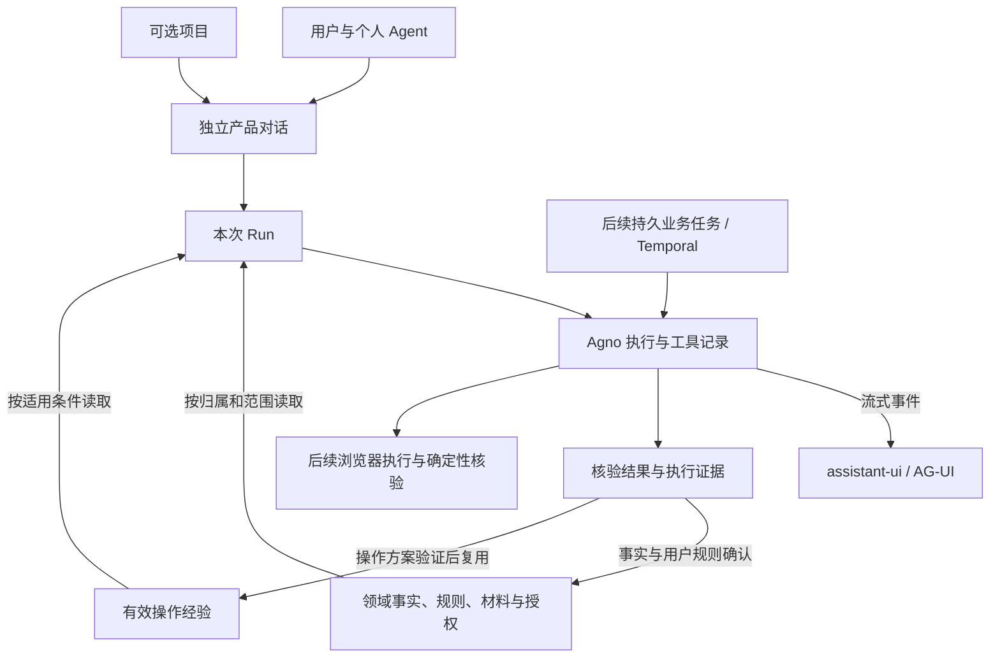

# Agent 运行、上下文与持续改进

更新：2026-10-04。本文是会话、Run、上下文、记忆和执行反馈的具体契约与验收入口。
产品需求在本地 PRD，稳定系统边界在本地 ARCHITECTURE；[workspace 设计](../workspace/DESIGN.md)
保留产品形态、交互与历史原型，[STATUS](../../handbook/STATUS.md)维护当前进度。
本文从原 workspace/DESIGN 的 Q14、长期上下文、进化和复用章节归并；公开内容仅来自原公开专题、
本次用户共识及仓库代码，不迁入私人设计或真实资料正文。选型与开发环境专题分别服务于组件决策和开发环境，
均不适合维护运行契约；本专题先只用这一份文件，不按记忆类型拆文档。

## 整体关系

个人 Agent 是用户持续使用的产品身份与协作方式，不是永不结束的单个进程、会话或模型。
个人背景可被多个独立对话按需读取，对话之间不因此共享完整聊天。项目是可选的上下文范围。

| 对象 | 归属与职责 | 不承担的职责 |
| --- | --- | --- |
| 产品对话 | CareerAct 管理稳定 ID、用户归属、名称/归档、可选项目及版本，关联运行记录 | 不能替代项目、材料、申请或长期职责 |
| Run | 一次受理的输入、上下文范围与框架执行；关联请求、对话及结果 | Run 完成不证明投递成功，不自动授予外部权限 |
| 领域数据 | CareerAct PostgreSQL 保存已确认事实、规则、材料版本、授权与业务结果 | 不由聊天摘要或模型自行改写 |
| Session/运行记录 | Agno 负责运行历史、工具过程及可复用的持久化机制，CareerAct 控制对产品暴露的接口 | 不成为职业领域真相；不能仅凭产品文本完整重放工具状态 |
| 任务/持续职责 | 跨系统、长等待或周期工作由领域任务关联 Temporal 编排 | 不为每条聊天额外创建一套 Workflow |
| 浏览器状态 | Steel 会话、单写者租约、Playwright/browser-use 执行与现场观察 | 历史 DOM/截图不是可恢复现场，也不是长期职业事实 |
| 草稿与工作面 | 未发送输入、标签和布局属于本标签页视图状态 | 不冒充服务端消息，不承诺跨设备草稿同步 |

## 已确认契约

2026-10-04 用户确认独立持久化对话、项目变化只影响后续运行、候选事实/规则确认、
CareerAct 管理产品历史；随后确认低风险经验自动记录、独立核验与回归后复用。
以下是设计约束；实现差距见[源码核对](#框架复用与当前差距)。

### 对话、项目与历史

- 每个对话有独立服务端身份和归属校验，明确关联 Agno Session；同一用户的全部对话不能共用一个线程。
  CareerAct 管理对话、归属、项目版本与必要运行关联；消息正文优先复用 Agno，经自有接口读取，只有实测缺口才补存储，不默认双写完整历史。
- 项目关联变化只影响后续 Run；历史消息和当次依据保留。受理时固定项目及关联版本，
  工具读取沿该 Run 的范围执行；有活动 Run 时先停止或等待终止再改关联，不修改正在执行的范围。
- 历史展示与发给模型的上下文分别处理。旧项目消息、工具结果、摘要或缓存不能在换项目后自动重注入。
  需要引用旧项目对象时重新校验归属、适用范围及授权并记录来源；首版无需实现任意跨项目检索。
- 新 Run 直接读取当前有效个人规则和当前项目规则，再按需读取档案与相关资料。
  规则是约束，检索片段/摘要是辅助；冲突、失效或必要读取失败须明确处理，不能静默用空结果或旧摘要继续。
  权限与有效授权优先；用户确认规则冲突时不得只按最后写入覆盖。
- “可读取”不等于“已读取”；本次依据记录实际对象 ID、版本、范围。冻结 Run 范围不等于复制所有资料：
  记录实际读取版本，外部动作前重新校验相关约束与授权。现有引用清单不是完整正文快照，也不保证精确历史重放。
- 同一对话首版只允许一个活动 Run；不同对话各自隔离，不承诺无限并发。请求去重、对话关联版本和活动运行
  在服务端校验；重复请求不能重复保存或启动，迟到列表/历史/流事件按对话与 Run 归属，不能覆盖当前视图。
- 项目删除沿用现有“保留对话/材料、解除关联、停用项目规则”语义；与 Run 的范围冻结一并验收，
  不能删除后将项目规则提升为个人规则。所有读写以服务端验证的用户为准。
- 旧单用户线程应保留可找回入口或明确迁移映射；不复制为多个虚构历史，不把本地草稿升级为已发送内容。
  页面归档、取消执行、解除项目关联和数据删除是不同动作，不能互相代替。

### 记忆与上下文读取

| 职责 | 保存及生效方式 |
| --- | --- |
| 工作记忆 | 复用当前 Session/Run/任务状态；恢复先核对实际状态，不重复建设一套运行引擎 |
| 语义记忆 | 已确认职业事实、目标、用户规则与决定使用领域对象，有来源、范围、有效状态和版本 |
| 情节记忆 | 从执行证据记录发生过什么、核验结果与纠正；模型归因另标候选，不让摘要替代证据 |
| 程序性记忆 | 操作方案有适用条件、步骤与核验方法；通过独立核验和回归才生效，变化或失败时停用 |
| 对话摘要/框架记忆 | 辅助继续交流，引用权威领域对象；不得覆盖当前规则或把推断升级为事实 |
| 索引 | 可重建检索手段，先用 PostgreSQL 查询和现有工具，不预建向量库/知识图谱 |

上述类型是职责与生命周期，不对应四套数据库。个人/项目/站点范围和确认状态属于每类数据的独立属性；
同一类记忆并不意味着可以共享。个人经验默认不进入全局知识，也不自动用于其他项目。

用户明确表达“今后按此规则”可构成保存确认，返回结果并允许修正；Agent 推断的职业事实、长期偏好与
用户规则仍先为候选。普通低风险笔记和辅助摘要可保存为未确认内容，不能因此用于正式事实或执行授权。
低风险操作事件可以自动记录；操作方案的验证通过与职业事实的用户确认是不同生效条件，前者不能替代后者。

既有 career 文件规则体现了“权威来源、当前状态和追加历史分别维护”的价值；产品继承连续性与可纠正性，
不继承私人文件树或将所有者的操作偏好强制给所有用户。本机资料读取授权不等于自动导入或向模型上传。

资料检索以用户已授权进入产品的对象为范围；先列举/查找再读取正文，不把全部资料塞进每次请求。
当前并未实现所有对象搜索。后续索引需验证中文、公司简称与精确编号；异步索引落后时应能回源并说明，
撤销和更新必须影响后续读取，不能由旧摘要恢复失效规则。

### 恢复与状态

恢复分别包括查看已保存历史、继续仍在运行的任务、从确定的业务检查点重试，以及在新任务中复用经验。
它们不是同一能力，不能由一个“恢复成功”概括。

- 单次 Run 复用 Agno 状态与取消机制，产品做归属、版本、请求去重及状态映射；不复制独立的推理/工具状态机。
  已受理、运行、等待、失败、超时、取消和完成按实际证据表达；超时不能伪装为用户取消，
  连接断开或流结束不能直接判为完成。未知结果作为待核对信息保留，不触发自动重试。
- 页面关闭后已受理任务继续的 PRD 需求保留；必须验证实际选用的后台运行/重连路径，不能把框架支持
  当成当前 AG-UI 路径已接通。服务进程重启与浏览器刷新分别验收；后台 asyncio 任务不等于持久任务重放。
- 历史恢复保留已持久化的部分内容及真实状态，缺失片段明确显示，不能承诺每个已经显示的 token 都已落库。
  当前文本链复用 Agno 的取消、错误和 Run 持久化；本轮已用合成流验证非终态不标完成，真实供应商断流后的保存范围与后台续跑仍待隔离验收。
- 跨系统业务任务复用 Temporal 的调度、等待、重试和恢复；领域状态记录用户关心的业务结果和证据，
  Workflow History 不替代领域结果。重试策略按副作用设计，结果不确定的投递/发送先对账。
- browser-use 的本次失败处理与历史压缩可辅助执行；长期进化还需要经验证的经验及检索。
  浏览器人工接管、Playwright 和智能执行互斥；恢复需重新观察并验证实际结果。

## 框架复用与当前差距

核对日期：2026-10-04；以下基于锁文件、配置及源码，只证明代码支持/当前接入，未新增运行验收。

| 组件与锁定版本 | 可复用与当前接入 | CareerAct 必须补齐 |
| --- | --- | --- |
| Agno 3.0.6（仓库 Fork） | PostgresDb、Session/Run、消息与工具记录、摘要、Memory/Learning、后台运行与取消；当前已接数据库、领域工具、动态规则、依据 metadata、对话 ID 和最近 3 个 Run 历史 | CareerAct 负责对话身份、领域归属/确认、上下文版本、请求去重和产品适配；正文按上述契约复用，不能把运行镜像理解为可随意删除 |
| browser-use 0.13.10（仓库 Fork） | 页面观察/工具循环、历史压缩、失败计数与重规划；依赖已锁定，尚无 CareerAct 业务执行接入 | 站点适配、字段计划、独立结果核验、授权与经验生命周期；不重写通用浏览器 Agent |
| Temporal Python 1.32.0 | 已有健康 Workflow；本地持久服务历史验证保留。部署 Server 1.31.2，本地 CLI dev 镜像 1.8.3 是不同组件 | 长业务任务/Activity 与领域结果关联；纯文本对话不以完整 Temporal 业务平台为前置 |
| assistant-ui/react 0.15.18、react-ag-ui 0.0.58；AG-UI JS 0.0.59、Python 0.1.22 | RuntimeProvider、按服务端对话绑定的流式事件、工具展示和历史适配接口；输入框已接真实 AG-UI 请求 | 真实供应商凭据、断流重连和页面关闭后台恢复仍待验收；不另写消息渲染/流协议 |
| PostgreSQL 17.6 | 现有职业领域表、Agno 存储及事务/条件写入；产品与框架可各守自己的 schema | 最小对话目录与运行关联，领域版本/并发约束；相同物理库不等于业务和框架共享真相，也无需按记忆类型另建库 |

关键证据与实际缺口：

- [对话目录迁移](../../../services/api/migrations/versions/0009_conversation_directory.py)及上下文版本迁移保存用户、项目、归档、版本和范围版本；
  [BFF 线程 ID](../../../apps/web/src/lib/agent-session.ts)沿用服务端对话 ID，
  [前端对话状态](../../../apps/web/src/lib/agent-space-state.ts)只保留草稿和工作面状态。
- [Agno 历史适配器](../../../services/api/infrastructure/agent_sessions.py)已从 Session 读取 user/assistant 消息，
  [框架 Session](../../../vendor/agno/libs/agno/agno/session/agent.py)保存多个 Run；再建完整消息库会产生双写、去重与一致性成本。
  所有者隔离和新目录映射已在合成 PostgreSQL 专项中重验。
- [AG-UI router](../../../vendor/agno/libs/agno/agno/os/interfaces/agui/router.py)普通请求提取最后一条用户输入；
  [Runtime 配置](../../../services/api/infrastructure/agent_runtime.py)已开启最近 3 个 Run 的历史上下文，
  通过 [范围钩子](../../../services/api/infrastructure/agent_tools.py)先按对话上下文版本筛选，再交给 Agno 组装，
  不把客户端完整历史重复注入。
- [领域工具和 instructions](../../../services/api/infrastructure/agent_tools.py)实际在
  [factory](../../../services/api/app/factory.py)接入；[上下文服务](../../../services/api/application/agent_context.py)
  读取个人及当前项目有效规则、档案按需加载，Run 以 `context_version` 绑定范围，依据保存在 Run metadata；
  复用该字段并验证保存时机，不预建第二套完整证据数据库。
- [前端历史适配](../../../apps/web/src/app/runtime-provider.tsx)按服务端返回的 Run 状态映射完成、取消、失败和未知；
  SSE 没有终态时明确报断流，历史读取失败不转为空历史。
- [Agno Agent 路由](../../../vendor/agno/libs/agno/agno/os/routers/agents/router.py)存在后台与事件恢复路径，
  当前首版 AG-UI 通过 CareerAct 适配器消费 Agno 后台运行事件，并沿用框架取消语义；
  [Web BFF](../../../apps/web/src/app/api/agent/route.ts)仍沿用请求 signal。
  断流后的重连、页面关闭后台续跑和进程重启后的恢复尚待隔离验证；本轮不另建运行状态机。
- 当前笔记/规则已有 candidate/confirmed/retired 和版本条件；修改规则回到候选，撤销不能直接重新启用。
  只存当前正文/软撤销行，尚无逐次版本审计、公司/批次范围和有效期；来源说明不等于已核验证据对象。
  合成材料有独立版本历史，不能据此宣称所有事实都有不可变历史版本。
- [Agno 学习配置](../../../vendor/agno/libs/agno/agno/learn/config.py)的 LearnedKnowledge 默认 global，
  PROPOSE 不是 CareerAct 归属/批准机制，HITL 枚举也不代表各 store 已支持；不能直接启用默认全局学习。
  [browser-use 状态定义](../../../vendor/browser-use/browser_use/agent/views.py)中的 memory、压缩和失败计数
  不证明跨任务学习；[Worker](../../../services/worker/workflows/system.py)仍只有健康 Workflow。

## 收敛结论与最小修正

| 问题 | 结论与处理 |
| --- | --- |
| 独立对话和长期个人 Agent 是否冲突 | 不冲突：对话隔离历史，共享经校验的个人领域来源；无需每项目复制档案或创建一个新 Agent 身份 |
| 项目切换既保留历史又不混入旧规则 | 可兼容，但必须区分展示历史与模型输入；摘要、工具结果与经验同样受范围控制，不能只改项目 ID |
| 冻结上下文和读取最新规则 | 固定当次项目/关联版本，记录实际读取版本；新 Run 读最新规则，外部动作前再校验，不要求复制所有内容 |
| 用户确认与自动经验冲突 | 不冲突：事实/偏好由用户确认，操作方案以独立验证生效，原始事件与模型解释分开；不统一成一个“已确认”按钮 |
| 会话产品真相导致重复存储 | 已消除歧义：产品归属与底层存储分开，按已确认契约复用 Agno；不以产品权威性为由重建完整消息库 |
| 三套状态机/四套记忆系统 | 无须新建：Run 状态复用 Agno，业务任务复用 Temporal 编排并保存领域结果；记忆按职责治理现有存储 |
| 完善设计推迟可运行版本 | 对话基础是第一个运行闭环的增量，历史连续性、有效规则和范围隔离进入首轮验收；复杂摘要/学习/跨站泛化后置 |

## 近期交付与验收

当前已完成第一项目录与历史增量，并接入最小文本运行链。近期目标是一条可继续对话的真实文本 Agent 链，分两个可验收增量，
不把“消息 CRUD 全做完”或“全部记忆体系建成”当成模型接入前置。进度只在 STATUS 更新。

| 层次 | 范围与门槛 |
| --- | --- |
| 已明确的系统边界 | 对话/Run/领域归属、项目与历史范围、确认与学习、恢复含义及消息存储复用；不先固定所有表结构 |
| 已完成的最小增量 | 独立对话服务端目录、项目/运行映射、归档/重命名、版本并发和历史读取，正式壳绑定服务端 ID；复用 Agno 历史，不实现独立消息编辑平台 |
| 已完成的最小运行链 | 已保存对话绑定同一服务端 ID；Agno 开启最近 3 个 Run 的历史上下文和自身 Run 状态持久化，CareerAct 按用户、对话锁和项目上下文版本做边界校验，现有输入框通过 AG-UI 发送并显示流式文本，停止使用框架取消语义，失败/取消/未知终态不标为完成 |
| 下一项运行验收 | 用隔离凭据验证真实供应商模型、断流重连、重开读取和页面关闭后的已受理运行；不先扩展长期记忆、浏览器或职业业务 |
| 之后按反馈演进 | 较长对话摘要、候选确认/撤销的持续一致性评测、一个职业业务路径，再验证表单“错误→修正→不复发→失效退出”；无须先实现通用学习平台 |

目录与历史增量已有的隔离验收使用合成用户、数据与 Session：
两对话同项目可分别创建/命名/归档与找回，刷新/新标签后目录和已有消息一致；
另一用户不能读写或伪造 Session 关联；过期项目关联被拒绝，迟到读取不覆盖当前对话；
旧线程及本地草稿保留并映射明确，草稿仍未发送。没有框架 Session 的空对话显示空历史，
读取失败显示失败，不能冒充空历史。若包含活动运行场景，用已有测试设施验证禁止中途变更范围。
上述目录验收未调用付费模型，未开放图片/BYOK、/compact、真实材料或外部浏览器；通过不等于真实模型运行链已验收。

首个真实运行闭环进一步验收：前文能在同对话继续，另一个对话不串入；个人背景跨对话按需引用，
候选不作事实；确认/撤销后的规则下一 Run 生效，换项目不继承旧项目规则/工具结果/摘要。
同一请求不启动两次，同一对话不并发跑两次；停止得到服务端结果，取消/失败不显示完成；
断流/重开恢复实际已存内容与状态，活动 Run 仍可查询，服务异常不自动重试。页面关闭续跑与进程重启
分别记录实测边界；框架能力缺口不得由假完成掩盖。摘要优化和长期学习的完整评测后置，但基本隔离、
有效规则与恢复状态不能延到“记忆阶段”才做。历史项目 A/B、旧线程兼容是全链路验收的一部分。

### 阶段性集成验收

2026-10-04，基线 `46849f3de`，修复提交待本轮验收收尾；接口与可见页面核心路径结论为**通过**，暂不进入下一业务增量。
沿用该提交的合成测试和隔离 PostgreSQL 证据，不重复全库审查；下表区分代码支持与本轮实际运行。

| 验收项 | 已有证据或代码边界 | 本轮结果与缺口 |
| --- | --- | --- |
| 浏览器 → Better Auth/BFF → API → 真实模型，流式、多轮、刷新历史 | 真实接口脚本与可见 `/workspace` 页面均走 Better Auth/JWKS、Web BFF、API、LiteLLM 和真实供应商 SSE | 页面发送出现真实流式文本；第二轮取回第一轮验证码；刷新与关闭页面后重开均可读取已保存历史 |
| 不同对话隔离、共享个人背景、项目切换、规则确认/撤销 | `scripts/smoke_agent_runtime.py` 使用合成账号与两对话通过；页面第二对话在没有验证码历史时返回 `NO_CODE` | 本轮页面账号无项目，项目 A/B 与规则确认/撤销继续以接口脚本证据为准；未读取私人资料 |
| 重复发送、运行中停止、取消/失败/未知状态 | 页面运行中重复快捷发送未启动第二个可见 Run；停止入口调用服务端取消并保留草稿；新增 Web 逻辑显示无 assistant 回复的取消/失败/未知 Run | 页面已验证取消入口与草稿保留；供应商故障由隔离合成测试覆盖，未人为破坏供应商 |
| 断流后重开 | SSE 缺少终态会报错；历史读取复用 Agno 保存内容及状态 | Web 现在按 API 活动 Run 列表恢复停止入口并轮询终态；未接流重连，不保证已显示的全部 token 保存 |
| 关闭页面 | CareerAGUI 使用 Agno `background=True`；框架以进程内分离的 asyncio task 继续生产事件 | 页面关闭后重新打开可读取已保存历史；真实接口关闭 HTTP 流后的进程内后台完成已通过，进程内任务不等于跨进程持久化 |
| 服务进程重启 | 当前入口未接持久执行队列或恢复调度；Agno 的进程内 task 无法跨进程续跑 | 优雅退出有框架尽力取消/保存逻辑，强杀可能留下 PENDING/RUNNING；本轮均未实测，不承诺自动续跑。现有准入会阻止未终态对话继续发送，尚缺安全核对/解除路径 |

环境检查：Docker PostgreSQL healthy、LiteLLM 运行中；Settings 加载通过，合成材料仍关闭。
受限推理 Key 从既有 `.env.litellm` 加载，`manage_model_key.py check` 通过现有权限/预算策略核对；
供应商 Key 仅检查存在，不证明模型可用或剩余额度。本轮使用隔离合成账号和合成领域数据完成真实模型调用；
未读取私人资料。关闭 HTTP 流后的进程内后台完成已验证；未执行服务进程重启续跑，也没有将接口测试计为新增浏览器验收。

最小剩余动作：进入下一项最小职业业务路径前，保留断流重连和服务进程重启自动续跑为独立限制；本轮不扩建持久恢复系统。
发现恢复问题后优先适配已有 Agno 运行查询/事件接口，保留原 Run ID，不通过重发新 Run 假装恢复；
进程重启自动续跑属于未接入能力，具体持久恢复方案后续单独验证，不在本轮扩建任务平台。

## 实施时验证与后续取舍

现有系统边界已明确，没有因消息存储选择而等待确认的阻塞。

- **工程验证，不另设产品审批：** 固定版本下同 Session 写入的并发保障、历史消息 ID/去重、失败部分输出
  的保存时机、后台运行到 AG-UI 的适配和重连、停止及进程重启后的状态。这些决定最小适配范围。
  只有必须削弱既有产品恢复承诺或改变关键契约时，才回到用户取舍。
- **后续场景再定：** 第一个职业路径/目标站点、经验有效期与推广门槛、历史内容长期保留与完整删除策略、
  精确回放是否需要不可变正文快照。敏感材料/浏览器开放门槛继续沿用 workspace 的隐私章节，
  不用当前文档定案宣称已开放；不阻塞隔离合成文本闭环。

## 表单反馈与 Agent 进化

2026-10-04 用户明确要求长期个人 Agent 从纠正中改善，尤其减少官网填表的重复错误，并确认：
**自动记录经验；经过独立核验和回归验收的低风险操作方案可复用，推断出的新规则先作为候选。**
这是对会话与上下文契约的程序性知识补充，不改变职业事实、用户偏好或外部动作的确认与授权边界；尚未实现。

**本次恢复和下次改进是两条链路。** 本次恢复依赖真实任务状态、重新观察和有限重试，框架可
提供循环与失败处理；下一次少犯错需要保存证据、归因、验证改进并在执行前取回。网页校验报错
只是信号，不能只让同一个模型声称“已改好”；保存后回读、关键字段比对和申请回执才是相应证据。
填写前从当前已确认档案、该岗材料和页面约束生成字段计划，核对类型、格式与来源；填写后逐项回读
保存结果。计划、实际值与错误的差异提供学习信号，不以一次模型判断替代字段核验。

| 反馈类型 | 应落到哪里 | 生效边界 |
| --- | --- | --- |
| 用户纠正经历、资格或长期偏好 | 领域事实/用户规则的修正或候选 | 用户确认；网页默认值、自动解析或一次拒绝不能改写本人事实 |
| 字段映射、日期/级联操作或保存步骤错误 | 站点操作方案、适配器或代码修复 | 独立核验及回归后复用；可稳定修复的代码缺陷进入实现和测试，不只追加 Prompt 提醒 |
| 新观察到的字数、附件或校招入口约束 | 带来源、页面范围和时效的站点知识候选 | 单次观察不推广到所有公司；与当前页面核对，冲突或失效时停用并重新观察 |
| 网络抖动、页面加载或会话中断 | 本次尝试记录与恢复策略 | 有次数/时间上限；不把偶发故障总结为永久规则，重开页面不保证恢复未保存内容 |
| 投递/发送结果未知 | 业务状态与对账证据 | 先确认原尝试结果，不重放提交；程序缓存和框架自恢复不能越过此边界 |

例如，合成表单的日期字段在编辑态有值，保存后却为空：先记录失败事件，定位是否没有触发控件
确认，再提出“按实际控件选择并保存后回读”的操作方案。用隔离表单验证正确日期、已有旧值、
页面变化和失败分支；通过后按相同控件条件复用，页面不匹配即退出缓存路径。不能写成“以后所有日期都这样填”。

操作经验须有用户/项目归属、站点与表单或控件适用条件、来源尝试、方案版本、核验方法、验证时间
及有效/失效状态。执行前先按身份和范围筛选，再检索相关经验；硬规则与授权直接读取。重复经验合并，
矛盾经验保留来源并待核对；站点变化或回归失败使相应方案停止生效，旧记录保留供追溯。个人资料不
自动变成全局知识，复用模板只参数化读取当前已确认事实，不缓存真实字段值、凭据或完整截图/DOM。

自动记录及复用不等于自动修改产品代码、全局 Prompt 或权限。可执行适配器变更仍经过工程验收；
候选生成不能批准自己。记忆、工具输入、页面指令均不能扩大用户授权，新的操作方案不自动开放浏览器能力。

**验收“越用越好”须可比较。** 固定合成表单和当前基线，比较加入经验前后首次填写正确率、首次
保存后关键字段通过率、人工纠正次数、同类错误复发率及可安全恢复比例。字段正确率与整表通过率
分开统计；错误被自动修复不计为首次通过。重复已知场景之外还要覆盖新站点/控件变化、撤销经验、
用户隔离和结果未知；改进不能靠跳过困难表单或漏查关键字段获得。目标是提高首次正确率，提交前所有
必核字段通过且结果证据充分；无法确定则停止，不承诺任意官网都一次成功。具体样本与门槛随首条表单路径确定。

调研依据（2026-10-04 已读取官方正文，未运行这些产品，也没有它们准确率的实测结论）：

| 来源 | 可借鉴的机制及限制 |
| --- | --- |
| [LangChain Memory overview](https://docs.langchain.com/oss/python/concepts/memory) | 区分线程短期状态、语义事实、情节经验和程序性指令；支持分层思路，不要求引入 LangGraph 或为每一类单建系统 |
| [Skyvern 执行循环](https://www.skyvern.com/docs/developers/getting-started/introduction)、[Code Caching](https://www.skyvern.com/docs/developers/features/code-caching) | 页面观察→动作→目标核验；成功步骤生成缓存代码，页面变化导致失败后回退 Agent 并更新缓存。CareerAct 借鉴适用条件、核验与失效回退，不无条件重放外部写操作 |
| [Skyvern Job Application Recipes](https://www.skyvern.com/docs/cookbooks/job-application-filler) | 申请是可跟踪的独立 Run，启动响应不代表申请完成；重复 Apply 请求可能再次提交。支持执行结果与请求防重的边界，不证明任意官网一次填对 |

实施顺序统一见[近期交付与验收](#近期交付与验收)；上述学习效果尚未验收。

## 四项选择的交叉验证

2026-10-04 实际读取以下官方正文与 Cue FAQ；这是公开资料核对，未登录实测 Cue/dots，
也未验证它们的数据库结构。资料没有推翻上述选择，但不支持宣称 CareerAct 与其内部实现一致。

| 来源 | 可核对的处理方式 | 对四项选择的支持与限制 |
| --- | --- | --- |
| [Codex 项目与对话](https://learn.chatgpt.com/docs/projects)、[长期工作](https://learn.chatgpt.com/docs/long-running-work) | 独立工作保留各自对话，项目共享来源与指令；CLI 恢复历史并读取当前工作目录 | 支持独立对话与共享项目上下文；没有披露换项目后的历史解释或服务端数据库归属，不能作为快照实现证据 |
| [Codex 记忆](https://learn.chatgpt.com/docs/customization/memories) | 本地记忆默认关闭，启用后可在后台从合适对话自动生成；使用记忆和贡献记忆可分别控制，强制规则仍放在 AGENTS/版本化文档 | 不要求逐条确认自动记忆；CareerAct 对有效职业事实/规则的确认是领域选择，允许辅助摘要但不把它升级为事实 |
| [dots 任务与记忆](https://learn.chatgpt.com/docs/dots/tasks-and-memory) | 委派任务有独立对话，只接收选定上下文；当前对话、相关 ChatGPT 记忆和自动更新笔记分开；完成 Run 不等于完成业务结果 | 支持任务隔离、分层记忆和结果核验；自动笔记并非完整历史，也未披露产品与 Runtime 的存储模型 |
| [Cue 官方 FAQ](https://cue.im/) | 用户提供职责和背景、设置审核边界，需要决定时 Agent 带回工作 | 支持由用户设定审批边界；公开页没有说明逐条记忆确认、项目迁移或会话持久化细节，不能据此补全内部设计 |
| [OpenAI Agents SDK Session Memory 示例](https://developers.openai.com/cookbook/examples/agents_sdk/session_memory) | 裁剪会丢失远期上下文，摘要可能丢失细节、带入偏差并累积错误，需评估验证 | 支持摘要与事实分离及长期一致性验收；这是 SDK 示例，不是 Codex 内部实现，也不构成替换 Agno 的理由 |
