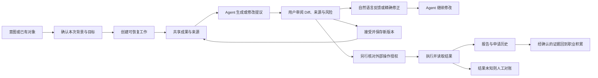

# CareerAct Agent 产品形态设计

状态：Codex 骨架已获认可，独立原型冻结，正式前端壳已收尾；系统契约迁至 Agent 运行专题。NPC／宠物／故事沉浸层保留为后续可选体验。更新：2026-10-06。
依据：PRD 1.3、3.2–3.8、4、5、6；ARCHITECTURE 2.1、2.4、3.1、3.6–3.8。
这是把需求翻译成可见交互的方案，不代表业务能力已经实现。2026-10-02 按用户明确授权同步
纠正 PRD 与 ARCHITECTURE 的产品主体表述，职业能力范围和技术边界保持不变。
阅读顺序：先看任务要求、当前骨架与实施计划；历史原型只供回溯，不能当作当前规格。
会话与运行契约见 [Agent 运行专题](../agent-runtime/README.md)；本文件维护形态与交互，当前进度以 STATUS 为准。

## 任务背景与已确认要求

以下归并本任务历次要求，作为后续设计与实施的约束；不新增 PRD 需求。当前目标始终是
先确定并打磨成熟的 Agent-native 产品形态，再把职业能力接入 Agent 的工作流。

1. **求职代表作与真实自用。** 项目要展示 Agent 应用的产品判断与工程能力，具有辨识度、
   面试演示价值和 GitHub 传播潜力。允许探索更有新意的协作形态，不能退回通用表单后台。
   新意既来自真实职业协作，也可来自角色引导、视觉识别与故事体验；角色表现须与真实工作状态一致，不能代替能力。Star 与推广效果不能由设计保证。
2. **完整职业能力范围。** Agent 能处理 PRD 的长期规划、职业积累、机会、申请、材料、沟通、
   日程、训练、面试、决策和持续职责。能力属于 Agent 的工作范围，不要求首页平铺为模块，
   也不能把首条投递路径变成产品定位。
3. **Agent 主创，人审阅与决定。** 用户讲述想法、提供反馈、确认事实和授权；Agent 负责
   理解、整理、创作、修改与推进。手动填写和直接编辑只作局部核对、精确修正或兜底。
4. **持续上下文与共享成果。** 目标、背景、约束、规则、来源和历史行动随工作关联；用户能
   继续工作、纠正记忆、查看依据和审阅成果。对话承载意图与反馈，成果和状态可独立找回。
   重点呈现任务状态、判断依据、结果、异常与待决定事项，不暴露完整内部推理轨迹。
5. **完整能力可发现，入口不必逐项平铺。** 通过目标、当前工作、相关对象与能力发现组织
   功能；不能用菜单数量充当产品完成度，也不能只给一个聊天框让用户猜有哪些能力。
6. **成熟克制的视觉。** 以本机 Codex 的实际布局、层级、密度和留白为主要参照；摒弃绿色主题、
   重复卡片、等权重容器和廉价 AI 装饰。视觉与交互一同验收，换成黑白不等于设计成立。
7. **从真实 career 经验出发。** 上级 `../` 是一年多的真实职业工作区，按下方
   [真实使用依据](#真实使用依据)选读，理解投递记录、额度、规则、材料版本、面经、刷题与
   实习积累的关联。读取授权不等于全量导入、公开正文或自动交给模型。
8. **轻量、可见、可回溯。** 复用现有专题；先用接近成品视觉的局部可点击效果确认骨架，再移入正式前端。已有静态原型冻结作为历史参照，
   不维护第二套完整 UI，不在草稿上反复抠细节。用少量可见场景集中评审，Agent 自行审查
   大量代码变更；关键版本按用户授权留 Git 基线，不要求用户逐文件审阅。

### 当前阶段与授权边界

- 前端审查清单已完成本轮收尾：演示残留、同一产品壳的连续体验、视觉细节和账户路径均按现有证据处理。
  用户已授权进入真实功能开发；本轮按最新要求暂停新增实现，只收敛系统方案与文档。恢复开发时按 [STATUS](../../handbook/STATUS.md) 选择当前增量，不同时展开全部职业能力。
- 已确定完整职业能力范围、Agent 主创与人审阅决策的分工，以及 Codex 式的项目/对话、中间 Agent、右侧多标签工作区方向。认可参考方向不等于具体像素、交互或实现已验收。
- NPC／宠物／故事沉浸层是认可的后续设计方向，承载引导、状态表达和长期成长叙事；具体形象、名称、人格和故事尚未确定。核心工作在收起角色后仍可完成。
- “渡鸦”、鹰、凤凰等只是历史品牌候选。先验证骨架，随后探索角色层；不把命名或跨应用桌面宠物设为当前完成门槛。
- Codex 是主要形态与视觉参照；Manus 只补充执行呈现与交接，Cue / dots 只补充持续职责与角色关系。不再把三者的首页或导航自由拼装。依据见[官方资料](#已实际阅读的官方资料)，未实测能力不得写成验证结论。
- 此前形态阶段可复用现有接口，并以明确标识的交互样例验证未实现能力；当时不新增业务 API、
  数据库迁移、领域工具或外部执行。发现技术不确定性先记录，确需独立实验时另行明确范围。
- 用户认可总体方向、要求实现前端、同意修错或说“继续”，都不能推导为业务开发授权。
  只有正式产品形态经可见评审通过，且用户明确要求进入业务实现后，才切换阶段。

### 偏差与修正

PRD 1.3、架构 3.1、Web AGENTS 和前端 Skill 曾同时使用“工作台围绕领域对象组织”的定义，
与用户确认的统一职业 Agent 主体冲突；这些当前定义已同步纠正。领域对象是业务数据模型，
不自动成为一级菜单或表单。原设计已写明 Agent 主创、成果优先和上下文随工作走，实现却主要交付模块页面与附加
对话区；导航可访问、持久化和模型调用通过被误记为“完整基座验收”。设计文档也存在
门槛不够明确、完成标注过宽，以及将人手动编辑放进核心示意的问题，并非只缺视觉细节。
后续又把 Agent-first 简化为删除导航、放大输入框，丢失项目、持续工作与多种内容的承载。
对话内“连续协作 / 并列协作”两种草图也被用户否决，不能作为后续实现底稿。
当前改为以实际 Codex 窗口建立具体空间关系；“成果优先”不再意味着成果始终占据主区，
“角色不能替代能力”也不等于禁止角色与故事。设计方向、可见验收和已有实现分别记录。

当前保留已实现的项目、会话、规则和合成材料实验及其技术证据；它们不证明产品形态
已达标，也不构成继续业务开发的依据。纠偏先收口整个前端协作方式，不回退有效工程成果。

已按本次授权阅读所有者的求职目标与投递策略，观察其目录中目标、实习、项目材料、岗位、
申请记录、准备训练和长期背景的关联。私人正文不复制进本稿或原型，原型使用虚构资料。

## 产品主线

**职业 Agent 是产品主体：中间持续协作，左侧组织项目与对话，右侧按需打开浏览器、文件、Diff 和职业记录等标签。个人职业上下文跨项目复用，可选角色层承载引导与故事。**

```text
用户表达意图 / 直接交给 Agent
                 ↓
       Agent 选择相关职业上下文
                 ↓
              Agent 推进一项工作
                 ↓
          可审阅成果、待确认问题、下一步
                 ↓
       修改 / 接受 / 继续准备 / 授权一次执行
                 ↓
       结果证据 → 项目记录 → 经确认的新职业资产
```

首页沿用同一产品壳：可开始对话，也可从左侧回到项目中的工作；没有打开内容时右侧可收起。
中间 Agent 承载意图、执行摘要、澄清、反馈与决定；右侧工作区既展示来源和执行现场，也展示
成果与记录。它不是固定成果详情栏，用户不必等待 Agent 生成结果才可打开已有文件或记录。
角色可以强化身份和沉浸感，执行状态须真实；完整内部推理与运维 Trace 不进入日常界面。

### 三个需要实际做出来的区别

1. **上下文随工作走。** 从岗位开始准备材料，自动带入相关背景、来源与约束，用户能查看
   本次用了什么。不是把全部职业资料永久塞进每次请求。
2. **在成果上协作。** Agent 先基于上下文生成或修改同一份成果；用户通过 Diff、来源和自然语言反馈审阅，手动编辑只用于精确修正或兜底。不在聊天、表单和独立“预览版”之间重复同步。
3. **行动回到职业积累。** 申请关联锁定材料与回执，面试准备引用实投版本，准备中的新
   证据经确认后进入背景。另一个“工程作品”项目可以独立推进，不必依附某次申请。

创新先检验这三个关系能否减少真实工作，不预建自由节点画布、复杂多 Agent 可视编排或
动态生成整套导航。产品界面要稳定，Agent 可改变任务内容，不随意重排用户的工作空间。

## 信息组织与交互

以下骨架方向已确认，具体控件、比例与交互直接在正式前端校准。

| 层次 | 用户看到什么 | 行为 |
| --- | --- | --- |
| Agent 首页 | 中间委托入口、少量示例意图；左侧保留项目与对话 | 可以直接委托，不必先填项目表单；也能恢复已有工作 |
| Agent 工作 | 中间持续对话、执行摘要、异常与待决定事项 | 打开右侧内容仍可交谈、补充条件或调整方向 |
| 右侧标签工作区 | 浏览器、文件、Diff、来源、记录和结果 | 按需打开、切换、关闭或收起；内容关联具体项目、对象、版本或执行会话 |
| 职业能力 | 机会、申请、材料、训练、项目等完整能力 | 通过自然语言、对象关联、搜索和次级导航发现 |
| 内容 | 阅读、修改建议、直接编辑、来源与版本 | 一个正文，不并排维护两份独立可写真相；复制纯文本不带 Markdown 标记 |

完整能力通过对话、关联对象、资料入口和可展开的能力发现到达；不把每项能力变成一级菜单。
需求覆盖表与 20 项能力检索保留全部范围，不以入口可见证明能力已实现。正式导航只放用户的项目与对话，不放合成使用示例；空态、失败与未接入反馈在相应操作处表达，不使用永久的形态预览页脚。

前端壳按以下顺序收口：

1. 清理演示导航、虚构历史、固定项目及制作说明，同步当前阶段记录。
2. 复用已有项目接口；统一路由与右侧标签承载，补齐草稿恢复、命名、对话归档、标签关闭/收起与分栏调整。项目作为对话的上下文分组，提供新建、命名和项目内新对话，不提供项目归档、恢复或归档筛选。浏览器草稿按登录身份隔离，限本标签页会话保存，退出清除；不能冒充服务端历史或领域材料。
3. 统一排版、焦点与提示、空态、加载/失败反馈和账户未保存确认。Logo 与角色另作候选研究，不锁定动物或品牌形象。

新壳尚未接入 Agent 执行时，发送不能制造回复或成功记录；输入保留并给出就地反馈。旧能力页面只作为过渡内容承载，不表示其表单交互已经通过形态验收。完成以上前端检查后，仍须单独获得进入职业业务的授权。

基础点击行为以用户目的验收：

- **新对话**始终进入 `/workspace` 的空白输入，关闭旧内容展示；只允许复用无输入、无打开标签的空白草稿，不能按旧对话的内容路由恢复。连续点击不堆积空白历史。
- **选择已有对话**才恢复该对话的草稿、项目和内容标签；新对话与恢复旧工作是不同操作。
- **项目旁的新对话按钮**直接开始该项目内的工作；顶层新对话回到个人空间，项目展开/收起只改变列表。
- 未保存的职业背景、项目或规则从侧栏、能力入口、内容链接和标签关闭离开时，都使用产品内的继续编辑/放弃并切换确认；取消保持原内容，确认才导航。
- 无内容的空白草稿不占据历史列表；项目归档及把恢复硬编码为暂停的旧逻辑撤回。既有领域状态和已保存数据不随导航整改修改。

### Codex 骨架与标签工作区

2026-10-02 已实际查看本机 Codex 桌面窗口，而不只是内置浏览器网页：最左为图标轨道，
旁边为有文字的项目/对话列表，中间为 Agent，右侧为文件与多个浏览器标签。该观察是本轮
布局参照；不推断 Codex 未观察到的内部实现，也不复制品牌资产。

| 区域 | CareerAct 的职责 | 关键行为 |
| --- | --- | --- |
| 可折叠侧栏 | 新对话、能力检索、共享背景/资料，以及职业项目与对话 | 展开时是一栏；收起后变为窄快捷栏，二者不并排重复。项目可收起，设置固定左下；切换后仍能找到原来的工作 |
| 中间 Agent | 一项工作的持续沟通与简短执行反馈 | 用户给意图，Agent 创作和推进；不是附在业务详情页上的小聊天栏 |
| 右侧工作区 | 多个可切换的浏览器、文件、Diff、岗位/申请记录等标签 | 来源、执行现场与结果共用承载区，按需打开并可调整宽度；首版不需要面向用户的终端 |

浏览器标签表达当前站点、任务和控制归属，支持暂停与人工接管的可见状态；实时画面不是
内部思维链，也不代表执行成功。研究、核对来源同样可以打开浏览器，不限于申请提交。
材料正文、Diff 和历史引用同一对象及明确版本；右侧切换标签不新建对话、不丢未发送意见，
关闭标签不删除材料、不取消任务，也不释放已发生操作的责任。
换对话或项目后恢复其关联标签；共享资料可以复用引用，不能把上一项目的执行授权带入新项目。
用户选中文档内容或指定浏览器页面后，能看清反馈指向什么，不把所有打开标签自动送入模型。
窄屏在对话与当前内容间切换，两个区域的页头都有导航抽屉入口，不保留常驻窄栏。

2026-10-03 再次观察本机 Codex 的展开/收起：它保留全局窄栏，折叠项目/对话宽栏，
当前对话与右侧浏览器继续存在。CareerAct 当前只有一个 Agent 空间，全局切换职责不足，
因此按用户的双栏冗余反馈改为一套可折叠侧栏；借鉴工作连续性，不机械复制栏数。

本轮正式前端的交互复核与取舍：

| 维度 | 当前调整 | 保留的边界 |
| --- | --- | --- |
| 导航层级 | 展开与收起入口互换，焦点回落到对应按钮；列表独立滚动，设置固定底部 | 项目与对话数据、弃稿保护沿用已有实现 |
| 空态与输入 | 删除宣传式欢迎语、重复能力入口；输入随内容增长至 240px 后内部滚动 | 只有草稿时不伪造消息记录；发送未接入仍在操作处如实反馈 |
| 并行工作 | 内容展开时输入区落在 Agent 区底部；无标签时内容开关禁用 | 关闭/隐藏不等于删除对象或取消任务 |
| 内容与上下文 | 收起动作同时隐藏上下文和路由内容，恢复时保留未保存编辑 | 跨标签不自动传递模型上下文；系统边界见 [运行契约](../agent-runtime/README.md#对话项目与历史) |
| 搜索与键盘 | 单列结果；上下键、Home/End 选择，Enter 打开，保留 Ctrl/⌘ K 和 Escape | 20 项能力是可发现范围，不代表均已实现 |
| 窄屏 | 顶栏进入抽屉，内容可返回对话；搜索/账户弹窗接替抽屉 | 390px 浏览器模拟验收不代表手机真机及软键盘验收 |

该增量已完成本地交互检查，用户随后认可简洁骨架并要求完善输入与上下文细节。
次级工作面继续逐项收口；当前接入边界见下一节，最新优先项以 STATUS 为准。

### 个人、项目与当前工作的上下文

| 范围 | 内容 | 复用方式 |
| --- | --- | --- |
| 个人共享 | 已确认经历、能力证据、长期约束、通用规则与可复用材料 | 各职业项目按需引用同一来源，纠正后影响未来读取 |
| 职业项目 | 阶段目标、项目专属规则、相关申请/训练/任务与对话 | 秋招、国考等各有范围，不自动混用资格判断与规则 |
| 当前工作 | 本次岗位、材料版本、选区、来源与浏览器任务 | 在对话和右侧内容间关联；实际使用的上下文可查看 |

共享上下文不等于共享全部聊天记录或每次加载全部文件；历史申请继续引用实投版本。
界面显示当前位置与引用范围，Agent 负责取回相关资料。后台仍沿用现有领域归属和版本规则，
本次文档定案不增加索引引擎、记忆框架或业务接口；后续实现遵循下方契约。

2026-10-03 用户复核确认：CareerAct 是同一个长期个人 Agent，不需要在输入框中选择“个人空间”。
项目是对话可选的关联上下文，补充目标、项目规则与相关对象，不切换 Agent，也不关闭个人共享背景。
项目入口按 Codex 新聊天页放在输入框上沿；未关联时只保留项目图标和悬浮提示，不显示“未关联项目”等裸露状态。
右上入口使用图标和悬浮提示，面板内部再说明共享资料、项目补充和本次实际引用。
未运行的对话只显示无读取记录，不把可用资料冒充已读取。

### 会话与上下文交互

系统契约、存储取舍和验收集中在 [Agent 运行专题](../agent-runtime/README.md#已确认契约)。
界面按独立对话展示历史，项目入口改变后续运行范围；未发送草稿与本标签页布局保留为视图状态。
项目切换、读取失败、活动运行与历史恢复必须向用户表达真实状态，不能用空历史或假完成掩盖失败。

### 输入框与 Agent 接入边界

用户认可当前简洁骨架，本轮继续完善输入控件与字体。输入框沿用 Codex 的上下关系：项目入口在输入框上沿，
“＋”在左下，模型入口靠右，发送为最右侧圆形图标；不增加虚假的模型列表、上传结果或流式回复。

| 能力 | 本轮正式界面 | 真正接入时必须完成 |
| --- | --- | --- |
| 图片输入 | “＋”菜单展示“上传图片 · 尚未接入”；用户明确选择本轮不打开选图或上传 | 选择/预览/移除、大小与格式、归属/生命周期、模型视觉能力与披露范围；上传失败和取消不能丢草稿 |
| Provider 与模型 | 显示实际模型名，菜单按 provider 分组并标记选中；对话选择保存后才更新，运行中禁切 | 白名单、下一 Run 生效与旧对话默认契约见运行专题；BYOK 管理未接入 |
| 流式输出 | 已复用 assistant-ui/AG-UI 接入真实文本，运行、取消、失败及未知提示与消息关联 | 断流重连、服务进程重启续跑等限制见运行专题，不播放动画模拟成功 |
| 通用快捷操作 | 提供现有 Ctrl/⌘ K、Ctrl/⌘ Enter、换行、Escape 与搜索方向键说明；输入法组合时不触发全局搜索 | 后续根据真实频次增加，避免与浏览器/文本编辑快捷键冲突 |
| `/compact` 等命令 | 不注册，不把输入当成已执行命令 | 属于会话运行与上下文管理；先定义摘要、保留证据、恢复与失败语义，不能代替长期职业档案 |

流式输出、附件与模型选择属于 Agent 基础交互接入，不是岗位/申请等职业业务模块，也不只是 CSS。
当前实现及运行验收见 [运行专题](../agent-runtime/README.md#近期交付与验收)；图片与真实材料仍未开放。

### 消息导航与后续交互取舍

2026-10-04 实际操作 Windows Codex 隔离合成对话：用户消息下方复制有勾选反馈；最近一条
提供编辑，点击后为原文输入与取消/发送，取消保留原消息。没有执行编辑重发，不能推断它如何
处理后续历史。模型入口在输入区右下，菜单有选中单选项和分组；未完整验证方向键焦点。
侧边聊天通过菜单/快捷键打开右侧；合成解释能引用主对话内容，界面提示临时聊天，关闭其标签
再打开为空。没有关闭应用，也没有验证底层上下文继承机制。
官方 [命令文档](https://learn.chatgpt.com/docs/reference/slash-commands#available-slash-commands)
明确 `/side` 是不打断主聊天的临时侧聊，`/fork` 复制为新的本地聊天或 worktree。本次已打开原文；
文档检索未找到存活侧聊如何更新主聊天上下文、是否全量注入的说明，不能推断其内部机制。

CareerAct 已复用 assistant-ui 复制原文与成功状态，按用户消息提供导航刻度、最长 300 字符的
Tooltip 预览、键盘跳转和当前阅读位置；视口变高只更新位置，不主动滚动。导航不改变模型上下文。
本轮没有在 Codex 合成对话实际操作导航刻度，不能宣称该交互已逐项对齐；CareerAct 验收见 STATUS。
实际字体栈为系统无衬线及中日韩 fallback，不能凭视觉说成衬线体；没有为对齐而引入新字体依赖。

2026-10-06 工作面收尾：对话菜单复用已有 Base UI Menu，侧栏使用已有 Collapsible 分别展示
“最近”和下方的“归档”列表，不用弹窗浏览归档。两组独立展开，选择通过现有工作面状态按
用户/标签保留；归档后移入归档列表，恢复后返回最近或所属项目。已归档对话保留历史与草稿，
只读提示提供恢复入口。普通对话删除有独立
确认、范围说明与未知结果核对，运行契约见[对话删除](../agent-runtime/README.md#对话删除)。
已定位侧栏观感偏黑的实际原因：壳定义了 foreground 变量却没有应用文本颜色，侧栏继承
全局近黑；统一壳/菜单/对话名的灰阶与 400 字重，保留原字体栈，不以模糊或文字阴影模拟字形。
“用时”复用已有折叠组件展示真实公开过程，边界见[运行专题](../agent-runtime/README.md#运行过程展示边界)。
上述交互的实际证据与未验收限制只在 STATUS 维护，不代表逐像素复制 Codex。

2026-10-05 用户确认通用对话管理优先沿用 Codex 等成熟产品的交互，不为常规菜单、命名、
复制、导航、聚焦和状态反馈重新设置产品选择题；实际表现未核实时补观察，不凭品牌印象推断。
模型选择已接入，契约统一见 [运行专题](../agent-runtime/README.md#对话项目与历史)，验收见 STATUS。
用户已明确同意剩余三项推荐，以下产品取舍已定案；实现与验收仍分别记录，不把定案写成落地：

| 能力 | 已确认方案 | 实现边界 |
| --- | --- | --- |
| 右侧副对话 | 单个临时侧聊，不入历史目录；刷新/收起保留，关闭丢弃，活动 Run 先停止核对；主/副同等能力，下一 Run 按需读取主线新增内容 | 服务端 Session、引用、按需读取、停止、关闭和项目范围已实现；可见合成页面与隔离 PostgreSQL 已验证 |
| 编辑重发/回退 | 最近输入就地编辑，发送到独立新对话；较早轮次显式分支，保留原历史 | 编辑入口为图标与 Tooltip，展开后说明独立分支语义并支持取消；不建设原对话版本树，分支不撤销材料和外部动作 |
| 材料部分接受 | 用户确认需精确到句内改动，部分接受/拒绝、其余待审并可反复打磨；不再推荐把未选项自动拒绝 | 修改块、审阅版本和冲突策略已接入；真实材料与富文本仍关闭 |

临时侧聊交互定案（已实现）：每个工作面浏览器标签只保留一个活动侧聊，不建一对多目录。
再次打开入口聚焦它；再次引用主回答时把引用加到侧聊输入区，由用户发送，不替换已有追问。
收起面板保留，明确关闭才丢弃聊天；首次关闭提示可勾选不再提醒，但运行中停止确认不受此偏好影响。
刷新保留，标签/客户端关闭后不提供普通历史找回；浏览器异常退出与服务端清理的限制需如实提示。
切换主聊天不自动改绑侧聊或其项目；面板标明原主聊天来源，从另一主聊天新建时提示替换当前侧聊。
用户若需要长期保存，可另行采用正式对话/分支；首版不因此再建侧聊收藏或管理系统。
主对话的新消息读取、同等工具能力与关闭的副作用边界统一见
[侧聊与分支运行方案](../agent-runtime/README.md#侧聊与分支适配方案侧聊与分支已实现)。

#### 待实现与验收清单

产品选择已确认，分项实现和最新可见验收统一见 STATUS；本表只维护剩余边界，不要求重新执行已通过增量。
本清单覆盖工作面的八项要求及直接相关的运行遗留；全产品后续能力继续由 STATUS 管理。
直接更新对应方案和状态，不另建临时流程文档。已通过的路径保留证据，不重新全库审查。

| 项目 | 实际剩余问题 | 下一步性质 |
| --- | --- | --- |
| 自动命名 | 新默认对话成功路径已通过；失败默认名已有显式重试和错误反馈；旧名称保守保留 | 名称语义质量不能由单次通过保证；旧名称不批量改写，不自动循环重试 |
| 模型 | 实际 provider/model 白名单、按对话选择与下一 Run 生效已接入，真实两模型合成调用及页面切换通过 | 配置与受限凭据交集不保证供应商永远可用；BYOK 管理仍后置 |
| 轮次导航 | CareerAct 定位、流式增长不抢位置及返回最新通过本轮可见采样；运行中使用即时跳转避免平滑定位被跟随覆盖 | 很多刻度及全部输入设备后置；仅导航已加载的最近 100 条消息，不代表全部旧历史可导航 |
| 副对话 | 独立 Session、引用、主线按需读取、停止、刷新/收起、关闭和项目固定范围已实现 | 真实 24 小时等待、异常强杀即时清理和未接工具仍不验收；共享搜索继续复用同一工厂 |
| 字体与视觉 | 当前布局和整体视觉已获用户接受，统一文字排版保留；真机输入法和全部触屏交互未完整验收 | 不再作为前端重设计或全量对齐的理由，随实际问题局部迭代 |
| 输出动态状态 | 等待、真实增长、完成、取消与用时有可见证据；失败/未知继续由回归和既有集成证据覆盖，Codex 对应状态未实际观察 | 本轮已接入真实公开过程展开与保存后恢复；展示与未保存内容边界见[运行过程展示边界](../agent-runtime/README.md#运行过程展示边界)，不制造空入口 |
| Prompt 复制 | 多行原文与成功反馈已实测；不同输入设备的显隐、Tooltip、键盘焦点及反馈结束尚未逐项核对 | 补交互验收，复用已有复制能力，不重新实现剪贴板体系 |
| 编辑重发/回退 | 最近输入编辑、回答分支和历史来源均已通过合成页面与 API 专项；不支持原对话版本树、工具重放或副作用撤销 | 后续只修复实际回归，不扩展为通用回滚 |
| 材料部分 Diff | 现有提议已绑定非重叠修改块，可独立接受/拒绝并保留剩余待审；版本和定位冲突明确返回 | 不开放真实材料、富文本或复杂三方合并；继续改写单个待审块留待后续小增量 |
| 刷新与中断恢复 | 历史、活动 Run 查询/停止和孤立 Run 安全核对已实现；本轮重载后的停止有可见证据；不保证每个显示 token 已保存 | SSE 接流重连和跨进程自动续跑后置，具体契约见运行专题；不重发来伪装恢复 |
| 增量回归与工具中断 | 最近一轮停止/重复发送沿用此前页面证据，项目 A/B 与规则确认撤销主要为接口证据；后续 Computer Use 被 Esc 停止，未完成的对照仍缺证据 | 下一增量按实际影响补可见回归；工具超时/中断不记作产品失败，也不记作验收通过 |
| 已明确后置能力 | 图片/多模态、BYOK、compact/摘要调优、长期学习、真实材料隐私/上传/导出、职业业务、持久自动续跑及角色层 | 保留 STATUS 与已有专题边界，不借本轮体验完善提前实现 |

框架分支能力与缺口统一见[运行专题](../agent-runtime/README.md#侧聊与分支适配方案侧聊与分支已实现)，
不把“框架可 fork”当作 CareerAct 任意轮次分支已经接通。

#### 字体与排版差距

证据分开记录：用户本轮并排截图是 Codex 与 CareerAct 的静态视觉参考；另已只读检查当前合成
CareerAct 页面和 CSS。没有重新测量 Codex 字体名称、实际字形或动态状态；截图缩放不能直接换算 CSS 字号。

| 问题 | 当前证据 | 修正方向与验证 |
| --- | --- | --- |
| 字体回退与中英混排 | CSS 首选 Inter，但没有 `@font-face`/`next/font` 加载，页面 `document.fonts` 集合为空；后续为系统无衬线与中文 fallback。不能据此断言本机未安装 Inter，或具体汉字一定用了某一字体 | 查实际 rendered fonts，先统一可靠的中英组合；确需字体资源再核对授权与加载成本，不仅改栈中名称 |
| 字号与墨色 | 正文 14px/400、行高 23.8px，标题/对话名 13px，输入 14px/23.1px；正文与侧栏大多共用接近黑色的 foreground。截图中右侧笔画显得更硬、更碎 | 统一正文、控件、辅助文字三级尺度与颜色；正文从 15–16px 做同文比较，具体值由实测确定；柔和不靠全局透明度/模糊，正常文字保持至少 4.5:1 |
| 阅读节奏 | 正文宽度上限 736px；列表项间距 4px，消息 gap 24px。截图里回复内部长列表较密，消息间留白较大，长行强化文本堆积感 | 联合校准字号、行长、列表/段落及消息间距，避免只放大字号或一律扩大行高；不重排工作面骨架 |
| 全局一致性 | 侧栏、菜单、输入和 Markdown 使用分散的局部字号；截图中缺少统一的视觉层级，不能只归因于字体家族 | 复用少量现有 CSS 变量统一正文、标题、菜单、对话名、输入和提示；同时核对链接、强调、引用、代码、表格及交互状态 |

验收采用同一组合成中文/英文/数字/标点样本，对照 Codex 的实际界面，在相同缩放与显示环境下
观察，不混淆模型生成的斜体/粗体与字体渲染。覆盖空态、长回复、菜单、窄屏、键盘焦点和流式增长；
实时与历史使用同一排版，不以截图“更柔和”代替多轮、停止、草稿和滚动回归。Windows 字形栅格化
可能影响观感，现有 `antialiased` 类不是保证跨平台一致的修复；不使用文字阴影或模糊模拟字体。

#### 分阶段推进与验收

| 顺序 | 独立增量 | 最小验收出口 |
| --- | --- | --- |
| 1（已完成） | 字体与工作面排版统一，补已承诺的导航/复制/状态细节与运行用时 | 实际结果与证据见 STATUS；保存后用时来自 Agno 指标，实时本页计时单独标注；不推断 Codex 字体或未出现的状态 |
| 2（已完成） | 实际模型名称与真实切换，自动命名失败补救 | 白名单与实际 Run 模型一致，按对话保存、下一 Run 生效、活动时禁切；命名失败不阻塞，迟到响应不覆盖手动名；实际证据见 STATUS |
| 3（已完成） | 中断与孤立 Run 安全核对 | 活动 Run 保留执行锁并拒绝解除；孤立记录标为未知，保留片段并允许显式新发送；页面断流恢复/停止与合成 PostgreSQL 核对通过，强杀未实测；证据见 STATUS |
| 4（已完成） | 最小共享网页检索工具 | 主 Agent 复用 Agno/DDGS，真实合成问题返回官方来源；失败/无结果/调用边界替身通过；侧聊将复用同一能力，不扩展招聘巡检或浏览器投递 |
| 5（已完成） | 单个临时侧聊、引用与按需主线历史 | 主/副 Session 隔离，同等已接工具；主线更新下次按需可读、当次范围固定；刷新/收起/停止/关闭重建、换主聊天与项目隔离通过合成验收；实际证据见 STATUS |
| 6（已完成） | 编辑重发与指定轮次独立分支 | 新对话保留边界前上下文，运行中限制有效；可见合成页面创建、编辑取消、真实重发、刷新与来源返回通过；不重放工具、不撤销副作用 |
| 7（验收中） | 合成材料句内 Diff 与部分审阅 | 修改块已提交，持久化并发、针对性改写、可见隔离页面验收未完成；默认材料实验关闭 |
| 阶段回归（已完成，边界记录） | 前端工作面组合回归 | 对话、侧聊、分支、复制、刷新与状态路径完成合成/可见核对；材料使用隔离 PostgreSQL/Web 检查，日常服务仅验收到默认关闭提示，真实材料后置 |

每项先核实现有能力，再实现最小适配；按实际影响补测试与可见合成验收，继承证据与本次实测分列。
每项独立达到提交门槛后才建立本地提交，不把多个未完成增量混成基线。正常 UI 迭代用 Fast Refresh；
代码提交检查遵守 AGENTS，若要求 build，沿用隔离暂存树检查以保护日常 dev，不以 UI 禁止日常构建为由省略提交门槛。
不 push。图片/多模态、BYOK 管理、长期记忆、真实材料开放、职业业务及自动续跑仍按 STATUS 后置。

### 可选角色与故事层

NPC／宠物形象与故事沉浸是骨架之上的体验层，用于形成识别度、引导用户表达目标、带回
进展与决定，并把真实准备、复盘和成长串成连续体验。用户可收起角色，正常任务与成果仍可使用。
形象、称谓、人格、叙事风格及动效均待设计，不把渡鸦或任何职业称谓提前写死。

角色状态对应待命、执行、等待用户和完成等真实状态；故事可以包装经历，不能编造职业事实、
虚构任务完成或改变授权边界。先验证产品骨架，再做少量角色表现的可见比较，检验是否帮助理解
与继续工作。当前不建设养成数值、角色编排平台或强制打卡机制。
网页内角色与跨应用悬浮的桌面宠物是不同交付范围；后者属于未来客户端方向，不触发本轮换栈。

### 档案、材料与原件

用户可先导入、粘贴或讲述意图。Agent 根据已确认事实生成或修改内容，用户通过审阅、反馈和必要的精确编辑确认结果。原始 PDF/DOCX/TXT 保留为来源；职业档案保存已确认
事实；简历、准备稿和报告保存相应表达与版本。它们可以在同一工作区关联，但不能混成
同一个可覆盖文件。事实确认、接受改稿、授权申请是三个不同动作。

不要求用户选择数据库格式。正式实现延续 PostgreSQL 领域数据、Tiptap 内容与对象存储
原件；可提供纯文本、Markdown 或 PDF 导出。界面主态是可阅读内容，结构化核对只在执行
需要补充字段时局部出现。原型不实现解析、Tiptap、版本后端或真实文档导出。

### 代表性路径

1. 回到“2027 秋招”，看到已经整理好的材料与两处待审阅建议。
2. 打开材料，原位比较修改；查看来源；接受一处、保留另一处，或继续要求调整。
3. 所有建议处理完后，进入申请准备；显示锁定版本和具体岗位。
4. 在申请预览中核对，必要时接管；授权仅限本次申请。
5. 读取结果并形成回执。未知结果转人工核实，不提供自动重投。
6. 从实际申请材料进入项目讲述与面试准备，把薄弱项加入项目任务。

机会研究作为另一条入口：一次委托返回带来源、匹配原因和未知项的候选；用户可继续研究
或进入申请。定期关注由单独授权开启，仅覆盖配置的来源；不承诺全网实时监控。

## 原型与初版效果图

历史原型：[prototype/index.html](prototype/index.html)。复现方式见专题 README。
下列截图只用于回溯，不代表当前规格；不重新开启 3210 来评审新骨架。

| 场景 | 检查重点 | 效果图 |
| --- | --- | --- |
| 项目首页 | 当前目标、Agent 交付、可继续的工作，直接恢复上下文 | [01-project.jpg](prototype/screens/01-project.jpg) |
| 材料审阅 | 正文主导、就地 Diff、来源、接受/拒绝和继续委托 | [02-review.jpg](prototype/screens/02-review.jpg) |
| 机会调研 | 推荐依据、未知信息与下一步；无需伪精确匹配分 | [03-opportunities.jpg](prototype/screens/03-opportunities.jpg) |
| 申请执行 | 当前岗位、材料版本、待授权、接管与结果核验 | [04-execution.jpg](prototype/screens/04-execution.jpg) |
| 能力准备 | 实投材料变为准备内容和持续项目任务 | [05-practice.jpg](prototype/screens/05-practice.jpg) |
| 窄屏 | 保留正文和主要动作；导航与 Agent 详情按需展开 | [06-mobile.jpg](prototype/screens/06-mobile.jpg) |

### 视觉取舍

以实际 Codex 的中性配色、紧凑导航、清楚的正文层级和标签工作区为参照。保留中文可读性，
不用大欢迎语、重复卡片或满屏小灰字取代工作内容。对话与右侧内容可按任务调整宽度，
不规定成果永远占主区。局部样机的视觉须足够接近成品，便于判断品味；逻辑只做到能比较关键交互。
角色表现可以有个性，与基础工作区域的克制和可读性分层处理。

## 参考依据与已撤回方案

保留官方研究与必要的撤回理由；旧方案的详细首屏和推进指令已移出当前规格。
产品范围仍由 PRD 决定，当前决定与待定项以本文开头为准。

### 当时的问题判断

- 正式应用的表单证明了数据持久化，却没有表达“理解背景、协作产出、持续推进”的产品关系。
- 功能覆盖版有完整入口，但主要靠菜单切换和固定 Agent 侧栏；伙伴没有独立的职责与可纠正的
  工作背景，用户与 Agent 也没有真正围绕同一成果交接。
- 6901 临时草图和 3210 覆盖版都不是当前实施依据；前者停止维护，后者只作历史回溯。
- 绿色底色、细碎灰字、重复标题和等权重容器削弱了秩序。仅改颜色、增加头像或更换“Agent”
  标题，无法补足协作方式。代表作需要用可操作的工作关系证明设计与工程能力。

保留的判断：Agent 应能接住职业事务，成果可找回、反馈和复用；成果主要由 Agent 创作维护，
用户以目标、反馈、审阅和授权驱动协作。角色与故事可增强这种关系，具体表达待设计。
持续职责、成果交接和视觉识别共同服务产品价值，不以其中一项替代其余部分。

### 已实际阅读的官方资料

下列页面正文已访问；Manus 与 Cue 仅研究公开页面，没有登录验证其产品能力。
OpenAI 文档描述也不等于当前账户可用性或性能保证。网页、文档与本机可见 Codex 的观察分开记录。

| 来源 | 官方内容与可观察形态 | 对 CareerAct 的推导 |
| --- | --- | --- |
| [Manus 2.0](https://manus.im/zh-cn/blog/introducing-manus-2-0) | 9 月 28 日发布页介绍 Studio：人与 Agent 共用工作空间，按成果引入专业编辑面，用户可以直接改，再交给 Agent 继续；Cloud Computer 支持长期工作，Automations 支持定时与已连接服务事件 | 材料、机会比较、训练和执行用稳定的专业工作面；人改过的内容成为 Agent 下一次工作的起点。持续工作由持久任务与授权调度实现 |
| [Manus Cue](https://cue.im/) | 独立应用，强调拥有邮箱、电话、钱包与电脑的 Agent 身份、离线继续工作与例行职责；FAQ 说明用户设置审核边界，需要决定时 Agent 带回工作 | 借鉴连续责任、权限和主动带回决策；不照搬钱包、电话与群聊。CareerAct 的角色层另行设计，表达“负责什么、依据什么、何时找我” |
| [OpenAI dots](https://learn.chatgpt.com/docs/dots) | 常驻伙伴，跨工作持续推进，用户可以继续交流、调整优先级；活动与成果和主对话区分，浏览器可交接 | 验证职业 Agent 如何协调多个工作、恢复成果和待决策事项；参考产品的角色称谓不自动成为 CareerAct 定位 |
| [dots 任务与记忆](https://learn.chatgpt.com/docs/dots/tasks-and-memory) | 会话上下文、长期笔记、委派任务各有范围；定期工作需要保存调度，连接来源不等于开启监控；完成 Run 不等于结果实现 | 显示本次实际使用的背景与版本；记忆不能取代职业领域真相。一次工作、持续职责、结果验证分别建模 |
| [ChatGPT Space](https://learn.chatgpt.com/docs/space)、[在 Space 中与 Agent 工作](https://learn.chatgpt.com/docs/space/agents) | 页面、文件和相关工作放在同一空间；在正文选区、评论或旁边对话发起修改，审阅提议后继续；写下周期不等于任务已安排 | 在材料和准备内容上直接协作，不反复复制到聊天；开启托管后须看得到保存的范围、计划与实际运行结果 |
| [项目与对话](https://learn.chatgpt.com/docs/projects)及本机 Codex 可见交互 | 项目保存共享来源与指导，每个独立成果可以有自己的工作；本机具备文件/浏览器/审阅面，工作可继续 | 职业项目保留长期结构，一项工作携带相关对象；对话是控制与澄清入口，成果有独立入口 |
| [OpenAI Computer Use](https://developers.openai.com/api/docs/guides/tools-computer-use) 与[集成安全指南](https://developers.openai.com/api/docs/guides/tools-computer-use-integration#handle-user-confirmation-and-consent) | 应用提供并隔离执行环境；页面内容默认不可信；敏感数据输入、发送/提交等风险动作在临界点确认；执行设置站点/动作白名单、步数/时间/成本限制，并核验实际结果 | CareerAct 的 Agent 不接收证件、密码、验证码或 Cookie 明文。受控执行器按任务和字段授权在隔离浏览器中注入，向 Agent 返回非敏感状态与证据句柄；截图、DOM 和录屏按敏感观察隔离，未知页面或风控转人工 |

名称记录：**Cue 来自 Manus；已有 OpenAI 研究记录使用 dots / Space 名称。** 无法断定用户
刷到的是哪篇资讯。2026-10-01 本轮重新读取了 Manus 2.0 官方文章和 OpenAI Computer Use
及其集成安全指南；OpenAI 文档只作为安全边界依据，不代表当前账户可用性或性能保证。
参考产品不是运行依赖，厂商规模与发布文章也不能证明设计适合 CareerAct。

本轮主要布局直接参照已观察的 Codex，Manus/Cue/dots 只补充适用的交互；不复制品牌资产。
已有[设计原则](../../handbook/DESIGN_PRINCIPLES.md)继续适用。
用于 CareerAct 的设计假设是：**Agent 能承接工作、延续上下文、交付成果，并把必要的决定交回用户。**
角色层围绕这种协作能力设计；具体形象与人格尚未决定。

系统决策的官方依据已随契约迁到 [Agent 运行专题](../agent-runtime/README.md#四项选择的交叉验证)；
本节保留形态参考与撤回依据。

### 已撤回方案

| 历史方案 | 撤回原因与仍有价值的部分 |
| --- | --- |
| A 常驻伙伴 / B 共创工作室 / C 职业路线 | 已撤回 B＋A 组合推荐；简报、编辑器和路线视图不能主导整个产品。保留持续职责、同一成果协作和跨阶段证据复用的需求 |
| 固定模块工作台 | 能力入口覆盖不等于 Agent 形态成立；领域对象与有效技术实现保留，模块首页与附加聊天侧栏不再使用 |
| 正式前端纯委托首屏 | 用户否决；缺少项目/对话组织与多种内容的承载，删菜单和扩大输入框不能解决问题 |
| 对话内“连续协作 / 并列协作”草图 | 两者均被否决；未忠实表达实际 Codex 骨架，不以其中任一方案继续开发 |

冻结原型、版本与旧验收记录从 [专题 README](README.md#原型与版本证据)回溯。
历史方案的详细布局不再并列写成当前设计指令；原型文件不删除，有效需求与工程证据继续保留。

### 关键交互流程



浏览器在右侧标签中承载研究、核对和执行现场，可按需放大或收起。人接手后 Agent 暂停控制，
交还时再验证业务进度。接受提议、确认事实、授权提交仍是不同动作。
持续职责与一次执行分别暂停或撤销；撤销不回滚已发生的外部动作。

### 可见验证与渐进实施

此前形态交付直接参照本机 Codex 的空间关系，展示同一职业对话打开浏览器、文件和 Diff，
以及项目切换时的上下文范围。视觉接近成品，逻辑只做到能评审；使用明确标识的合成内容。
沿[实施计划](#实施计划与验收门槛)先确认骨架，再进入正式 `apps/web`，不同时维护完整样机与正式应用。
角色层在骨架之后探索，独立评审其引导和沉浸价值。真实任务质量、后台持续性和业务结果留在
后续业务验证，不以状态动画或技术检查替代；也不等待全部次级页面与品牌细节完美才允许业务评审。

## 完整产品基座升级方案

历史方案：2026-10-02 以 Codex 骨架方向重新编排；以下实现差距描述保留当时背景，当前形态证据见后文“当前可见状态”，不作为重新启动基座审查的指令。
计划以[当前阶段与授权边界](#当前阶段与授权边界)为准，本轮不修改 PRD 范围。

### 已有实现与尚未通过的形态门槛

既有 Web 曾以分组导航、当前项目和待决定事项组织首页；这些布局不再是当前候选。
现有 20 个能力入口和原路由保留在搜索索引中。正式首页的纯委托候选也已被用户否决；
当时页面尚不具备已确认的 Codex 骨架。内容、记录、审阅、执行和管理能力作为适配素材保留。
背景默认阅读，保留精确修正。项目列表、详情、版本条件更新和刷新恢复已接入；共享
Runtime 为每个登录用户复用稳定的 Agent 会话标识，项目详情记录项目关联，服务端按用户归属恢复文本历史。
现有 Agent 已注册服务端职业上下文读取和待确认规则提议工具。Runtime 移到共享 layout 后，
收起与换页不再重新生成 threadId；刷新会复用当前登录用户的工作台会话标识，并恢复 user/assistant 文本。每次工具调用按验证的 user_id 和会话项目读取确认档案、项目、确认规则及未验证笔记；规则提议保存为候选，不可由 Agent 确认或撤销；项目详情可以恢复已保存的目标与状态。
上述是已有技术实现。项目/对话导航与右侧标签区仍待按新骨架验证，专业工作面与 Agent 当前工作的关系
尚未统一，项目建立仍有手动表单路径；材料阅读、Diff 与版本只解决局部协作。因此此前
“完整基座通过”的判断撤回，整体形态仍须完成下列门槛。隐私方案继续保留为未来能力
开放的必要条件，不能用继续补隐私后端替代当前产品形态任务。

正式基座验收须同时满足；局部可见样机只用于决定骨架，不要求一次覆盖全部页面：

- **可承载完整能力**：PRD 能力能映射到对话、项目与适用标签，常见能力有发现路径；后续实现清单明确，不以菜单数或完整业务页面数衡量骨架。
- **共同协作方式**：中间 Agent 与右侧内容始终关联，项目/对话切换、上下文引用、反馈、审阅、授权与异常各有明确位置。
- **持续性表达**：目标、当前工作、背景/规则、成果和待决定事项关系清楚，用户能判断什么可继续。
  复用已有项目/会话恢复；未接入的跨对象关联用明确样例验证形态，不因此扩建后端。
- **真实边界**：当前可用、等待用户、失败、没有内容、未接入、未知结果分别表达。尚未接入的投递、搜索、语音、导出与托管动作不伪装成功。

### 隐私与数据安全前置门槛

存储职业内容、发送给模型和向招聘方提交分别授权。L1 职业资料仍属个人/保密数据；L2
证件/金融/健康等受限信息与 L3 密码/验证码/登录态默认不进入普通职业数据、模型、会话、
Memory、Trace、日志、索引和普通备份。产品认证 Cookie 和未来专用凭据存储单独管理。
本地目录/本地部署也可能向远程模型发送内容，不能承诺“本地就不外发”；BYOK 也不是端到端加密。
早期使用普通职业工作区，敏感步骤暂停交给用户；本地执行桥作为后续选项，不扩成本轮前提。

以下保留未来业务能力开放的安全依赖；当前形态阶段不按此表推进后端。P0 的已有技术
证据不授权进入 P1，也不代替正式产品形态验收。

| 门槛 | 代码/工程落点 | 开放条件与已有证据 |
| --- | --- | --- |
| P0 当前输入与会话前置（已有技术验证） | API 用例与 AG-UI 入口、Web BFF/Agent 区、项目关联与历史读取 | 档案/项目写入和 Agent 请求在存储/Runtime 前拒绝可识别的受限内容；有限 JSON 文本请求，附件/客户端工具/任意状态暂不开放；错误不回显原文。31 项隐私测试、默认回归、项目归属隔离和可见合成输入验证通过，属于保留证据 |
| P1 材料与上下文前置 | 领域授权/版本、对象存储、Agent 工具、Agno 会话/Memory、LiteLLM | 选择性来源与模型范围明确；导入先本地检查/预览，不自动传整份文件给模型；私有对象、短时下载、模型出口检查及框架副本清单/保留/撤销/删除可验证，之后开放材料主创。旧数据/工具返回不能靠 P0 检测推断安全 |
| P2 浏览器敏感执行前置 | Temporal/Browser 授权账本、互斥接管、证据采集 | Agent 只获得岗位/表单结构、字段语义、任务范围和短时授权句柄，不获得敏感明文；隔离执行器负责填充并返回字段状态/核验句柄。输入敏感字段或提交前在风险点确认；页面指令不扩大权限，未知页面、验证码、风控和最终提交可人工接管。工具填充后 DOM/截图仍可能泄露，模型观察和截图/录屏须隔离；未来完全敏感托管另验密钥管理、最小授权和专用加密存储，未通过保持关闭 |
| P3 公开服务前置 | 部署、供应商配置、数据管理 | HTTPS、静态加密/密钥权限、日志最小化、各副本删除与备份到期/恢复防复活、数据用途/期限/供应商告知均有证据，再进入真实用户试用；当前本地通过不代表生产就绪 |

P0 的模式识别用于减少误输入，不是完整 DLP；精确住址、健康事实、图片和混淆秘密不能
靠少量规则可靠判断。不能自动改写职业事实或声称已全面脱敏；拒绝后让用户删去受限内容，
输入仍可在本次页面内修正。公开演示仍只用合成资料。P1–P3 随对应功能验收，不阻塞所有
普通职业功能，也不因插入隐私任务而取消会话、规则、材料与申请的后续计划。

P2 的执行契约沿用 OpenAI 官方 Computer Use 安全建议：应用而非模型决定是否执行，执行器
使用隔离浏览器与站点/动作白名单；第三方网页、邮件、PDF、截图和工具输出均视为不可信内容；
敏感数据输入、上传、发送或提交属于传输，需在临界动作前取得明确同意；运行设置步数、时间
和资源上限，取消后不继续动作，并用确定性读取确认结果。CareerAct 因此不会把“Agent 能读取
职业上下文”实现为把用户的身份证、密码或验证码塞进普通模型上下文；普通 Agent 只能得到
脱敏状态和授权范围，敏感值由专用执行器或用户本人处理。

当前只评审这些能力怎样呈现范围、状态、授权与异常，复用已有数据或标明交互样例，
不新建领域对象或持久化。业务阶段的材料、申请等另有真实验收，不能以页面按钮计为完成。

### Agent 首页与能力发现

首页和工作中的页面共用[Codex 骨架](#codex-骨架与标签工作区)。左侧项目/对话可辨认，
中间承接意图并继续协作，右侧按需打开内容；角色层可以收起。背景以阅读内容为主，
Agent 根据讲述或资料提出补充，缺少执行字段时再局部核对，不把长表单作为日常入口。

完整能力通过 Agent 工作中的相关动作、可展开的能力索引、搜索/命令入口发现。可以分组，但保留
现有路由与直达路径；项目与对话保留名称，不把全部能力只藏进搜索。用局部样机先验证
“查某公司申请”“搜索官网机会”“整理面经”“更新实习表达”的发现方式，再适配正式页面。
命令搜索检索能力名称与对象，自然语言委托由 Agent 理解，两者不混成装饰输入框。

| 正式工作面 | 保留的能力 | 应呈现的内容与协作位置 |
| --- | --- | --- |
| 项目与职业积累 | Agent 工作面、职业项目、职业背景、资料与成果、能力与成长 | 目标/阶段、内容与来源、关联工作、经历证据；讲述/导入、提出补充、版本与复盘 |
| 机会与申请 | 机会发现、申请追踪、材料审阅、申请执行 | 岗位来源与判断、申请列表与历史、实投快照、正文提议、授权与结果核对 |
| 沟通与时间 | 招聘沟通、日程与提醒 | 消息/通知与申请关联、回复提议、承诺待确认；场次与多个申请可关联 |
| 准备与选择 | 准备与训练、项目讲述、模拟面试、职业决策 | 公司研究/面经/刷题、实投材料关联、训练记录、反馈与下一步、个人决定与理由 |
| Agent 与执行管理 | Agent 上下文、工作、持续委托、结果报告 | 职责、已确认背景/规则、待核实经验；单次任务、持续服务、成果和异常分别呈现，是否独立成页待评审 |
| 账户与连接 | 设置与连接 | 产品身份、模型与来源、用量/撤销/数据管理边界；不暴露运维管理凭据 |

详细覆盖仍以[需求覆盖复核](#需求覆盖复核)为唯一清单。本表定义工作面，不追加更多模块。
共享组件先覆盖内容阅读/审阅、列表/详情/历史、任务状态、上下文选择与决策面；出现实际复用
后再抽组件，不建设通用插件系统或模型生成 UI 的运行平台。

用户应能查明“记住什么、依据什么、完成什么、何时需要我”。待命不能显示为一直运行，
界面常驻不意味着模型全天调用。委托、状态、上下文和反馈可采用内联、并列区或按需展开，
由实际工作比较决定；跨工作概览不复制另一套材料和申请记录。持续性不依赖人格化包装。

### 长期上下文与反馈的呈现

记忆分工、执行反馈、框架复用与系统验收统一见 [Agent 运行专题](../agent-runtime/README.md)。
界面需要让用户查阅来源和适用范围、确认或纠正规则、查看本次实际依据；候选、有效、失效和运行结果
分别表达。用户无需选择数据库或记忆术语；技术执行记录不能伪装为已完成的职业成果。

### 实施计划与验收门槛

本节保留形态阶段的交付记录；Agent 接入的具体顺序与验收统一在 [运行专题](../agent-runtime/README.md#近期交付与验收)，当前进度见 STATUS。

| 顺序 | 交付范围 | 完成门槛 |
| --- | --- | --- |
| 1. 文档纠偏（已完成） | 同步当前方向、架构边界、状态与设计原则，移除旧布局和旧推进指令 | 当前骨架与历史依据分开；保留研究、真实需求、隐私与工程证据；文档检查通过，业务代码未改 |
| 2. Codex 骨架可见验证（骨架已确认） | 左侧项目/对话，中间 Agent，右侧可切换浏览器/文件/Diff | 用户认可骨架，样式与菜单细节转入正式前端打磨；停止维护独立样机 |
| 3. 正式前端壳适配（已完成） | 在现有 Next.js 中落地已选骨架，复用组件和可用接口；明确未接入能力 | 导航、对话、标签切换/收起/恢复、输入控件和窄屏路径已按当前证据收口；真实 Agent 执行与服务端历史仍未接入 |
| 后续 Agent 接入 | 复用正式壳，将对话和真实运行接通 | 见 [运行专题](../agent-runtime/README.md#近期交付与验收)，不在此维护第二套系统计划 |

第 2 步不再比较被否决的“连续协作 / 并列协作”方案，也不重新设计三套产品。
参照图、合成文案与少量点击状态足以判断骨架；不铺全部路由、不接模型或数据库、不建新工程体系。
评审聚焦最多三处关键问题，下一轮只修这些问题；既有需求覆盖表用于防遗漏，不变成全量页面制作清单。

形态交付的评审标准（保留供复核；当前实现范围以 STATUS 为准）：

- 新对话与恢复项目工作共用产品壳；没有内容时右侧可收起。
- 一项职业委托可打开浏览器核对岗位，再切到关联材料和 Diff；中间仍可继续发指令。
- 用户能看清本次引用的个人背景、项目规则与材料版本；换项目不会混用规则或执行授权。
- 未接入执行在操作处给出准确反馈；暂停/待决定与审阅反馈有位置，不展示内部思维链，不在正式导航植入示例历史。

后续正式基座复核覆盖改写经历、查申请、准备面试、更新规则和跨项目成长；
按“怎样开始、引用什么、Agent 做什么、内容在哪里、人如何介入、如何继续”逐项自审。
完整能力保留，但不再把首页入口数量当作完成度。业务测试、真实资料 Dogfood 与生产隐私另行验收。

角色层与专业骨架分别评审：网页内角色先验证识别、引导和状态表达；跨应用桌面宠物留待客户端专题。
当前只约定分层，不预建通用角色引擎、插件平台或冻结尚未验证的业务 API。

### 当前可见状态与待交付效果

正式职业路由已统一到 Codex 骨架的 Agent 空间：左侧读取已有项目，中央保留本标签页的对话草稿，
右侧承载路由内容、上下文与可切换标签。正式导航移除合成示例，20 项能力检索保留。
次级页面仍是过渡内容；旧 3210 原型只供回溯，两种对话内草图均被否决。
用户已确认后来的 Codex 样机骨架，授权直接在正式前端完善细节；独立样机停止更新。
第 2 步已交付对话内 `careeract-codex-shell.html`：合成官网岗位、简历与修改对比在右侧切换，
项目/对话导航与中间 Agent 协作保持同一壳；支持新对话、上下文查看、暂停/接管状态和审阅反馈。
实际浏览器已检查桌面效果、切换标签保留输入、采用改稿后演示材料更新，脚本语法检查通过。
该冻结样机是本地点击状态，无模型、数据库或真实网站执行；窄屏与完整任务状态未验收，右侧拖拽调宽
尚未制作。样机位于会话可视化目录，不成为仓库内第二套产品。其骨架已获用户确认，第 3 步已获授权。

正式前端已完成清单的首轮整改及连续体验复核：无示例历史/虚构回复/预览页脚；草稿、名称、可恢复归档、标签列表
和分栏按用户隔离保留在本标签页，支持刷新恢复。标签、当前路由与收起状态进一步按对话隔离，
完整保留材料查询参数；归档草稿只读，恢复后才可继续编辑。已有项目读取/创建/重命名复用现成接口；项目归档/恢复入口已按用户纠正撤回。
项目菜单提供删除，并在产品内确认项目名称与影响范围。删除项目组织，保留对话与材料并解除关联；
项目笔记/规则在同一事务中停用并更新版本，避免删除后变成个人规则。个人职业背景不受影响。
删除要求当前版本与用户归属校验；冲突或结果未知时先重新读取核对，不自动重试。
前端同步清除该项目的详情标签和对话归属，其他项目与未删除材料标签保留；项目列表随修改更新。
这不是整份用户数据、模型副本或备份的删除功能，相关隐私门槛继续保留。
上下文切换和内容收起不卸载当前路由内容；职业背景已补齐与项目、规则共用的离开保护，确认在产品内完成。账户的未保存和退出确认在弹窗内完成。
本地已验证跨能力切换、草稿恢复、归档恢复、账户确认、鼠标/键盘调宽和窄屏返回，检查证据见 STATUS。
窄屏导航使用有焦点约束的抽屉；新建/重命名等弹窗接替抽屉，不叠加两层操作。材料服务不可用时，
显示读取失败与重试，不同时展示可创作的空态。材料标签已支持读取真实标题、按查询参数切换对象；
实验仍默认关闭，本轮没有真实材料数据来验收文件名、版本、来源和多材料切换的完整链路。

此前草稿刷新、标签隔离和窄屏等局部检查不能证明基础点击体验完整；用户反馈已复现
职业背景点击新对话仍恢复原路由，以及未保存职业背景绕过侧栏保护的问题。整改与复验记录见 STATUS；
项目归档已撤回，不再列为待完成能力或形态验收门槛。
整改后已实际验证桌面和手机的职业背景→新对话、项目内新对话、旧草稿恢复、取消保留输入与
确认后切换；项目未保存输入从能力入口或关闭标签离开也有同一确认。此证据限这些基础路径，
不能推导为全部前端交互或职业业务已经验收。
账户未保存退出已验证；登录返回地址已有前端支持，未退出当前用户来实测重新登录。
服务端多对话历史、跨标签/跨设备恢复、真实 Agent 执行、浏览器会话与对象版本标签尚未接入，
不能把本标签页草稿称为完整历史。正式前端壳已收尾，系统接入仍待实现；当前目标与限制见 STATUS。
次级内容按接入需要局部修正，其他业务依赖仍待接入，不重新设计骨架。

按用户授权留可回溯 Git 基线，提交目的清晰，不把历史业务实验与形态修改混成一次提交。
本计划不构成自动 commit、push、部署、真实资料上传或外部操作授权。

### 材料文本纵向切片（合成实验）

沿已确认的“Agent 主创、用户反馈与审阅”落地：资料与成果/材料审阅共享同一领域工作面，
从委托创作开始，草稿保存为待审阅提议；正文、Diff、来源和版本按需切换，手动编辑仅为
精确修正。初次接受才产生 v1，后续接受/手动保存产生不可覆盖的新版本；拒绝保留正文。
提议定位材料整体 ID 和不可变基准版本，不以 Diff 行号定位写入。旧提议保留原始比较，但
不能接受覆盖新版本；可拒绝或反馈给伙伴重新生成。接受改稿不确认职业事实，也不授权投递。

该历史实验只验证合成纯文本，不开放真实私人资料、文件上传、对象存储、PDF/DOCX 导出和岗位
锁定版本；不以输入模式检测宣称 P1 已通过。API 的合成实验开关默认关闭，仅在本机验收
进程启用。事实来源是本次实际读取的对象与版本，尚不是逐句的证据核验；没有引用的正文
明确以本次合成委托为依据。模型返回内容仍在保存及接受前检查，存量材料读取也先检查。

此实验暂停继续扩展；不是当前产品形态任务的下一步。未来开放真实材料须先验证事实引用、
P1 的选择性来源/模型出口和副本生命周期。当前文本提议会经过 Agno 会话、工具事件和
已配置模型；其生产保留/撤销/删除尚未验收，不能把合成实验当作真实资料开放。

### 材料精细审阅方案（合成增量已实现，真实材料待开放）

用户已确认简历需要逐句、句内词语的反复打磨，支持部分接受、部分拒绝，未处理建议继续待审。
当前材料仍是纯文本；已在合成增量中复用不可变版本、提议来源、事务与基准条件保护，并将
提议绑定到字符级修改块和审阅版本。真实资料、富文本和完整页面开放仍关闭：

- 展示按句/段落组织，句内精确高亮增删，允许分别处理独立的词语替换；行号只帮助阅读，不作为写入定位。
  一次替换的删除/插入成对接受，不能因视觉拆行把半个替换误作独立修改。用户可选定短语继续要求改写。
- 明确区分当前已接受正文与待接受建议。接受选定修改才生成新材料版本；拒绝只改变建议决定，
  不改正文；未选择的保持待审，不自动拒绝或重新生成。一个批次可同时接受多处并生成一个版本。
- 建议复用现有提议，补充绑定不可变基准的修改标识、精确原文范围及用户决定；刷新从领域接口恢复，
  不把编辑器内部状态作为权威。服务端核对用户、当前版本、提议版本和重复请求，原子保存正文与决定。
- 同一基准中互不重叠的剩余修改可随已接受改动确定性调整位置；其他手动修改或其他提议改变基准时，
  先返回冲突并保留待审内容。只有能精确映射且原文仍匹配时才允许重新定位；重叠、定位不唯一或
  明确互相依赖的修改要求重新审阅，不模糊套用、不全份覆盖。位置不重叠也不能证明语义独立，显示组合后的预览。
- 继续改写某一句时，仅基于当前版本与所选待审片段生成替代建议，保留被替代内容的来源；其他已接受内容
  与未选建议不丢弃。撤销已接受表达另走版本恢复/反向修改，不把“拒绝待审”当作撤销历史版本。

复用依据：锁文件已有 Tiptap 3.31.3 及 `@tiptap/pm`，其 `prosemirror-changeset` 提供增删范围、
元数据与增量变更集合；[ProseMirror Mapping](https://prosemirror.net/docs/ref/#transform.Mapping)
提供编辑后位置映射及删除信息。它们不自带 CareerAct 的审批、数据库事务或跨版本授权校验；
changeset 默认忽略 marks/attributes，不可直接声称覆盖完整富文本审阅。当前材料正文仍是纯文本，
首个增量不为精细 Diff 强制迁移全部存储。文本差异优先验证已有 `difflib` 的字符范围；
如展示质量确有缺口，再评估 [jsdiff](https://github.com/kpdecker/jsdiff) 的字符/词语差异及
`Intl.Segmenter` 中文分词；显示分词不能成为跨端写入坐标的真相，默认 patch 位置搜索也不能替代精确校验。
[Tiptap AI Toolkit](https://tiptap.dev/docs/ai/ai-toolkit/overview) 当前标为付费 Beta，
旧 AI Suggestion 已废弃，不假设现有开源依赖免费附带完整 AI 审阅能力，不因调研安装或采购。

合成验收已覆盖：同句多处独立替换分别接受/拒绝；另一处保留待审并可刷新恢复；继续改写其中一处
不覆盖其他决定；首稿、重复接受、并发冲突、过期版本、重复原文位置、中文/英文/换行/emoji、重叠与依赖修改均有明确结果。
隔离 PostgreSQL 专项 10 项通过，Web 63 项回归通过。可见日常页面只验证到默认关闭状态，
没有用合成开关污染日常服务，也没有把该状态写成真实材料能力。
格式标记、多人实时协同、任意复杂三方合并及真实 DOCX/PDF 排版不属于首个文本审阅增量。

## 真实使用依据

所有者本机的仓库上级 `../` 即 `career/`，是持续使用一年多的私人职业工作区，也是本产品
的需求证据与后续 Dogfood 来源。所有者已明确授权按任务阅读。PRD 决定产品范围；真实资料
用于发现遗漏、细化验收和检验交互，不自动把个人规则变成全部用户必须遵守的规则。

进入产品设计任务时，先读该工作区的 `AGENTS.md` 和对应目录索引，再按当前场景选读。
不要求每个 Agent 每轮扫描整个目录；新克隆找不到这些私人资料时使用公开设计与虚构样例。
本轮做了四个主要资料区的目录盘点，并阅读下列索引和代表正文；没有逐字读取全部文档、
附件、代码仓库、历史归档或同步副本，也不把这些副本当成新的独立需求。

| 本地相对 `career/` 的资料位置 | 实际承载的工作 | 对产品的要求 |
| --- | --- | --- |
| `生涯背景/投递侧约束.md` | 长期目标、阶段处境、硬约束与能力边界 | 判断工作内容、资格与可迁移性；展示策略不能替代真实能力 |
| `秋招/投递跟踪/投递总表.md`、`状态变更日志.md`、该目录 README | 高频查进度，当前状态与追加历史分开 | 按公司/岗位/批次/通道查找，关联来源、实投版本和下一步；允许人工补录 |
| `秋招/投递跟踪/额度与志愿.md` | 不同集团、批次、渠道的额度和志愿规则 | 额度分组、先后次序、防重、转交与规则时效；不是每家公司一个整数 |
| `秋招/投递跟踪/开闸盯岗.md` | 未投、已开、待核实、不考虑的目标 | 关注名单不等于申请总表；保存跳过理由，指定来源定期核对 |
| `秋招/日程安排.md` | 笔试/面试窗口、固定场次、完成记录 | 一个测评可关联多岗；日程完成与各岗位招聘阶段独立 |
| `简历和面试/` 中的版本正文、链接口径、JD 建议 | 同一经历的中文/英文、多方向和岗位表达 | 原件、事实、表达、实投快照分别管理；字数、链接、附件与复制格式可核对 |
| `简历和面试/面经/`、`面试准备/` | 真实问题与当场回答、事后补强、按岗位组织突击 | 面经关联轮次与申请；准备引用当时投出的版本，不默认最新简历 |
| `秋招/刷题/每日推进.md`、算法笔记写法 | 算法、AI 机考、概念、AI Coding 的长期准备 | 题目/知识、练习记录、闭卷复测、薄弱项、每日下一步共同维护 |
| `实习/README.md`、`00-实习全景/`、`01-职责模块详解/`、`05-面试攻防/` | 职责、技术原材料、难题复盘、可迁移知识与表达 | 成长资产不能压缩为简历 bullet；一份证据可复用于简历、追问、作品和后续工作 |

观察到的关键边界：官网与邮件可能不同步；用户判断不等于正式结果；HR 转交不等于重新
申请；共用测评不等于共用招聘状态；实投版本不等于最新正文。产品要保留这些关系和依据，
而不是照搬私人目录的文件树或把历史不一致原样当作数据库规范。

真实资料后续按具体任务选择用于本地 Dogfood，并保留路径、版本、来源和确认状态；不全量
导入，不改动原目录，不自动向模型上传。公开原型继续使用虚构资料。联系方式、证件、
私人通知链接、企业内部资料和任何凭据不得进入公开代码、截图或本文。

## 需求覆盖复核

复核基准：本地 PRD（2026-09-29）第 1—6 节及上述真实使用场景。未修改 PRD。
这里核对产品形态，不调整需求优先级，不承诺首版全部落地。

“交互样例”表示页面内可操作并看到结果；“界面预留”表示能看到输入、输出、判断或授权位置，
核心动作尚未实现。这两者均不是业务集成通过。下表按需求组合列出，不以一级菜单数计覆盖率。
入口为原型 hash，例如 `#applications`；均可从侧栏、项目工作视图或相关动作到达。

| 需求依据 | 功能 / 必须保留的关系 | 原型入口与代表交互 | 当前深度 |
| --- | --- | --- | --- |
| 1.3、2、4、5 | 求职、准备、作品与入职成长；跨阶段背景复用 | `#project`、`#portfolio`、`#plan`、`#growth` | 项目视图与新项目草稿样例；任意项目实例待接 |
| 3.8、6.1 | 导入、粘贴、讲述；原件及来源保留 | 资料 → 添加资料 → 待确认草稿 | 粘贴样例；文件解析和语音入口预留 |
| 4、6.1 | 教育、经历、项目、成果、技能与证据 | 背景 → 事实与证据；成长 → 审阅事实 | 阅读、目标草稿、固定事实确认样例 |
| 3.1、6.1 | 目标、硬约束、优先级随阶段变化 | `#plan` → 调整目标与边界 | 草稿样例；历史目标存取预留 |
| 6.1 | 项目、里程碑、任务、复盘与归档 | 计划 → 里程碑完成、阶段复盘 | 里程碑样例；复盘/归档 UI 预留 |
| 3.2、6.1 | 能力账本、已有与待补、持续学习及工作成果 | `#growth` → 经历、证据、能力缺口 | 记录草稿与固定事实确认样例 |
| 6.1、6.7 | 历史版本及当时决策背景 | 资料版本、申请快照、决策理由、阶段目标版本 | 材料恢复样例，其余固定历史展示 |
| 3.3、6.2 | 统一职业助手，覆盖方向到入职发展 | 开始一项工作 → 意图 → 相关工作 | 保留委托、上下文与任务；不做意图推断 |
| 6.2 | 跨对话继承事实、目标、约束和历史 | `#assistant` 委托历史、任务上下文 | 当前页面内样例；长期记忆待接 |
| 6.2 | 建议转为项目、任务、材料、研究、训练、执行 | 选择工作去向、任务中心、各成果继续动作 | 固定路由与受理记录；领域工具待接 |
| 6.2 | 事实、分析、建议、用户决定分开 | 岗位判断、公司研究、事实确认、决策页 | 固定内容及决策记录样例 |
| 3.3、6.2 | 多模型 / BYOK 继承同一职业角色 | 设置 → 模型来源与用量/凭据管理 | 选择样例；密钥输入禁用 |
| 2.3、6.3 | BOSS、猎聘、官网和授权来源发现岗位 | 机会 → 检索范围；设置 → 来源连接 | 渠道与来源 UI 预留，无真实搜索 |
| 6.3 | JD、公司、编号、城市、薪资、通道解析 | 机会 → 岗位详情与判断 | 固定岗位示例，缺失信息显式待核实 |
| 6.3 | 目标、事实、约束、历史共同判断 | 岗位详情 → 匹配依据与未知项 | 固定判断，非匹配模型验收 |
| 6.3 | 重复申请、额度、志愿、截止、通道冲突 | 申请 → 额度与防重；岗位详情 | 样例规则与冲突说明，规则执行待接 |
| 6.3 | 推荐、跳过、升级用户判断 | 机会 → 待核实；暂不考虑原因 → 关注名单 | 本地原因记录与样例展示 |
| 6.3 | 新岗位与已有机会变化 | 关注名单 → 定期关注 → 托管 | 范围/频率样例，无全网实时监测承诺 |
| 3.2、6.4 | 基于事实的多方向材料与岗位锁定版本 | `#library` → 多方向材料 / 锁定快照 | 不同用途与版本展示 |
| 3.8、6.4 | 阅读、直接编辑、Diff、理由、来源 | `#review` 固定提议；资料 → 推理方向正文 | Diff 与纯文本编辑分场景演示，统一富文本编辑待接 |
| 6.4 | 接受、拒绝、继续修改、回滚 | 材料审阅接受/拒绝/撤销；资料版本恢复 | 本地交互；富文本定位/并发待接 |
| 6.4 | 字数、格式、版面及导出 | 材料 → 格式与导出；纯文本复制 | 复制可用，其余预留，非真实 PDF 生成 |
| 6.4、6.7 | 面试准备引用实际投出的版本 | 申请详情 → 实投快照 → 准备 | 固定版本关系；任意材料关联待接 |
| 6.5 | 主动打招呼、消息巡检、HR 主动沟通 | `#inbox` → 主动沟通 / 会话 / 值班 | 草稿与选择 UI，未连接招聘平台 |
| 6.5 | 有事实依据的回复、简历/简历卡发送 | 回复草稿 → 审阅发送；选择材料 | 模拟授权发送；事实核验与发送结果待接 |
| 6.5 | 技术问题、未知意图、时间承诺升级 | 沟通中的到岗问题与待确认邀请 | 固定升级场景，用户判断入口 |
| 6.5、6.10 | 沟通内容、依据和发送结果可追溯 | 消息未知结果核对 → 操作记录 | 界面预留，不自动重发 |
| 6.6 | 筛岗与进入当次岗位申请表 | 岗位身份 → 申请准备 → `#execution` | 固定申请链路，明确区别个人中心 |
| 6.6 | 文本/日期/级联/列表/必填项/附件映射 | 执行 → 填写、附件与保存核验 | 字段依据与读回结果预留，无真实自动填表 |
| 6.6 | 字数、链接、附件规则；覆盖旧值 | 填写核对表 → 锁定材料和格式约束 | 核对 UI 预留 |
| 3.6、6.6 | 保存后读取核验再提交；一次授权 | 申请预览 → 本次授权 → 模拟回执 | 固定授权/回执交互样例 |
| 6.6 | 登录、验证码、风控、未知字段、人工接管 | 执行 → 人工介入 → 接管 / 任务 | 控制状态样例；真实会话互斥待接 |
| 6.6 | 超时恢复、未知结果对账、申请结果回写 | 预览状态 → 提交结果未知；任务中心 | 无重投按钮；回写只在样例状态演示 |
| 6.7 + Dogfood | 查询当前状态、历史、材料、沟通、下一步 | `#applications` → 搜索/筛选/汇总 → 详情 | 本地可操作，不调用 Agent/招聘站 |
| 6.7 + Dogfood | 邮件/通知提取；保留来源冲突和人工记录 | 沟通 → 通知；申请详情 → 状态观察/调岗 | 观察追加可用，解析/转交关联预留 |
| 6.7 | 公司、业务、团队、招聘要求调研 | 准备 → 公司研究 → 来源范围 | 固定研究成果与未知项 |
| 6.7 | 面经汇总、去重、分析、关联岗位/轮次 | 准备 → 面经 → 原始回答/事后补强 | 样例与记录 UI，无真实抓取/归并 |
| 6.7 + Dogfood | 算法、知识、项目讲述、刷题计划 | 准备 → 计划/经历表达/刷题记录 | 笔记、复测反馈与下一步样例 |
| 6.7 | 文字/实时语音，中英文连续追问 | `#interviews` → 模式 → 回答 → 追问 → 反馈 | 文字固定问答；语音控件预留且不启麦 |
| 6.7 | 反馈、薄弱项、训练进度，动态调整任务 | 练习反馈 / 模拟面试 → 加入准备任务 | 固定反馈与本地任务样例，无评测模型 |
| 6.7 + Dogfood | 待办、提醒、时间节点、共用测评 | `#calendar` → 来源/关联申请/完成记录 | 固定日程与完成切换；实际提醒待接 |
| 6.7 | Offer、职业选择由本人决定，入职后积累 | `#decisions` → 比较/记录理由 → `#growth` | 记录个人决定，不对外接受/拒绝 |
| 3.5、6.8 | 后台续跑及完成、失败、超时、等待、暂停/取消 | `#tasks` → 打开/暂停/取消/重新受理 | 状态样例，无真实后台执行 |
| 6.9 | 托管与一次性工作分开；明确开启/暂停/恢复/撤销 | `#automations` → 审阅授权 → 控制服务 | 本地状态交互，无调度器调用 |
| 6.9 | 平台/岗位范围、动作、材料、频率、上限、到期 | 托管配置 → 授权摘要 | 可配置样例；对外动作默认关闭 |
| 6.9 | 发现、判断、触达、投递、回复、整理、报告 | 托管动作配置 → 一次巡检 → 结果报告 | 行为覆盖 UI，真正执行均待接 |
| 6.9 | 频率/并发限制、风控停止、防重、撤销止动 | 托管边界、任务等待、未知消息对账 | 固定边界展示，无真实风控/幂等验证 |
| 3.6、6.10 | 成功/部分/失败/跳过/未知明确区分 | `#reports` → 已完成/跳过/失败/待处理 | 业务报告样例，不展示内部 Trace |
| 6.10 | 敏感操作关联材料、授权、尝试和结果证据 | 报告 → 样例操作记录 → 申请 | 固定记录，不代表外部操作成功 |
| 架构 3.9 | 账户、连接、BYOK、登录态撤销与数据导出/删除 | `#settings` → 连接/用量/我的数据 | 管理 UI 预留；不接收密钥、不删除真实数据 |

需求覆盖的结论是：PRD 全部核心能力组已能定位到入口和代表 UI；并非每个分支都已实现，
上述“预留”项仍是明确的研发工作。注册/登录继续复用现有正式应用，不在静态原型复制认证。
原型也不包含运维 Trace、云控制台、计费后台等 PRD 之外的新平台。

## 后续接口落点

静态原型的 `workspacePages` / `workspaceRouteNames` 登记视图，`workspaceState` 保存虚构
数据，`handleWorkspaceAction` 演示领域动作；它们不访问真实服务，已冻结，不作为长期框架。
正式 `apps/web` 已有路由骨架及档案 API；其余领域能力尚未接入，以下是接口落点设计。

正式 Next.js 接入按下面的对象关系推进，沿用同源 BFF → `/api/v1` / AG-UI 边界。
当前接入契约见 [运行专题](../agent-runtime/README.md)，不为其他业务创建空后端或完整 OpenAPI；具体 payload 与版本约束随选定路径设计。

| 前端视图 | 后续需要的领域数据 / 动作 | 验收重点 |
| --- | --- | --- |
| 项目、背景、成长 | 项目 ID、事实/来源 ID、目标版本、任务/里程碑、确认/复盘 | 事实与表达分开，项目共享背景，归属和版本校验 |
| 机会、申请、日程、沟通 | 岗位/申请/渠道/批次 ID、额度组、观察事件、来源、共享日程关系 | 防重、追加历史、转交关联、证据冲突；不能依靠聊天找回状态 |
| 材料与训练 | 材料/版本/段落 ID、来源、提议、锁定引用、面经/练习结果 | 历史申请不变；训练使用实投版本；接受修改不等于授权申请 |
| Agent 与任务 | 对话关联项目/对象、上下文版本、任务 ID/业务状态、成果与待处理对象 | 页面重开恢复；AG-UI 不替代领域状态；未知写入不得重试 |
| 托管与报告 | 策略/授权 ID、期限/额度/范围、尝试、证据、报告结果 | 服务与单次运行独立；撤销停止未来动作，报告不能只看 Run 成功 |
| 连接与个人设置 | 连接 ID、模型别名、用量、撤销/导出/删除请求 | 不向浏览器暴露管理凭据；框架运维与产品身份隔离 |

当前按 [STATUS](../../handbook/STATUS.md) 选择接入增量；上表保留后续职业能力的接口落点，
不构成同时实现全部业务的指令。能力继续可发现，已定案、已实现与已验收分别记录。
