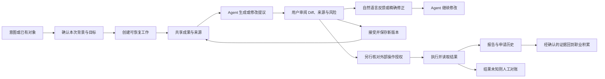

# CareerAct 工作台形态研究与可视提案

状态：形态已确认，准备正式前端实现。更新：2026-09-30。
依据：PRD 1.3、3.2–3.8、4、5、6；ARCHITECTURE 2.1、2.4、3.1、3.6–3.8。
这是把需求翻译成可见交互的方案，不修改 PRD，不代表业务能力已经实现。

## 先回答：为什么值得做这个作品

项目的首要价值是可展示、可复现、自己愿意反复使用的 Agent 应用。开发者同时处于求职与
能力积累阶段，时间和预算有限。因此要让一次演示展现完整产品判断：理解背景、提出行动、
产出可用内容、允许人修改、执行时守住边界、留下可继续利用的结果。

只增加一个聊天入口不能证明这些；大量资料表单也不能证明这些。视觉上的新意要来自人的
工作方式发生变化：用户围绕目标委托工作、审阅结果，而不必先搬运上下文、配置流程、填满字段。
竞争力能否成立，仍需真实任务完成率、复用率和使用反馈验证；不能由原型外观或 Star 数保证。

已按本次授权阅读所有者的求职目标与投递策略，观察其目录中目标、实习、项目材料、岗位、
申请记录、准备训练和长期背景的关联。私人正文不复制进本稿或原型，原型使用虚构资料。

## 产品主线

**职业项目是持续空间，一项委托是工作单元，可编辑成果是主要工作对象。**

```text
长期职业背景与证据
        ↓ 选择相关上下文
职业项目 ──→ 表达意图 / 直接打开已有内容
                 ↓
              Agent 推进一项工作
                 ↓
          可审阅成果、待确认问题、下一步
                 ↓
       修改 / 接受 / 继续准备 / 授权一次执行
                 ↓
       结果证据 → 项目记录 → 经确认的新职业资产
```

聊天承载意图和澄清；任务、内容与结果可脱离某段聊天继续找到。Agent 的工作存在感来自当前
任务、产出和可继续的动作，不靠一列长思考日志。技术 Trace 不进入日常工作区。

### 三个需要实际做出来的区别

1. **上下文随工作走。** 从岗位开始准备材料，自动带入相关背景、来源与约束，用户能查看
   本次用了什么。不是把全部职业资料永久塞进每次请求。
2. **在成果上协作。** Agent 先基于上下文生成或修改同一份成果；用户通过 Diff、来源和自然语言反馈审阅，手动编辑只用于精确修正或兜底。不在聊天、表单和独立“预览版”之间重复同步。
3. **行动回到职业积累。** 申请关联锁定材料与回执，面试准备引用实投版本，准备中的新
   证据经确认后进入背景。另一个“工程作品”项目可以独立推进，不必依附某次申请。

创新先检验这三个关系能否减少真实工作，不预建自由节点画布、复杂多 Agent 可视编排或
动态生成整套导航。产品界面要稳定，Agent 可改变任务内容，不随意重排用户的工作空间。

## 信息组织与交互

| 层次 | 用户看到什么 | 行为 |
| --- | --- | --- |
| 全局 | 开始工作、查找内容、职业项目、可复用背景与材料 | 随时从意图或已有内容进入；设置与连接退到次要位置 |
| 项目 | 目标、正在推进的工作、待审阅成果、资料与阶段计划 | 首页直接恢复工作；不放装饰统计，不要求先创建全部对象 |
| 当前工作 | 主区的成果或浏览器，旁边的委托、进度、上下文与继续输入 | 一次突出一个成果；相关内容按需打开，保留当前位置 |
| 内容 | 阅读、修改建议、直接编辑、来源与版本 | 一个正文，不并排维护两份独立可写真相；复制纯文本不带 Markdown 标记 |

侧栏保留项目、待处理工作和跨项目资产；项目内用工作视图区分计划、机会、申请、准备、
决策与资料。具体申请和任务从列表进入，不把每条历史记录塞进侧栏。完整需求须有可发现的
入口与代表交互；尚未实现的业务明确预留，不因首条展示路径暂时用不到而隐藏产品范围。

### 档案、材料与原件

用户可先导入、粘贴或讲述意图。Agent 根据已确认事实生成或修改内容，用户通过审阅、反馈和必要的精确编辑确认结果。原始 PDF/DOCX/TXT 保留为来源；职业档案保存已确认
事实；简历、准备稿和报告保存相应表达与版本。它们可以在同一工作区关联，但不能混成
同一个可覆盖文件。事实确认、接受改稿、授权申请是三个不同动作。

不要求用户选择数据库格式。正式实现延续 PostgreSQL 领域数据、Tiptap 内容与对象存储
原件；可提供纯文本、Markdown 或 PDF 导出。界面主态是可阅读内容，结构化核对只在执行
需要补充字段时局部出现。原型不实现解析、Tiptap、版本后端或真实文档导出。

### 代表性路径

1. 回到“2027 秋招”，看到已经整理好的材料与两处待审阅建议。
2. 打开材料，原位比较修改；查看来源；接受一处、保留另一处，或继续要求调整。
3. 所有建议处理完后，进入申请准备；显示锁定版本和具体岗位。
4. 在申请预览中核对，必要时接管；授权仅限本次申请。
5. 读取结果并形成回执。未知结果转人工核实，不提供自动重投。
6. 从实际申请材料进入项目讲述与面试准备，把薄弱项加入项目任务。

机会研究作为另一条入口：一次委托返回带来源、匹配原因和未知项的候选；用户可继续研究
或进入申请。定期关注由单独授权开启，仅覆盖配置的来源；不承诺全网实时监控。

## 原型与初版效果图

原型：[prototype/index.html](prototype/index.html)。启动方法见专题 README。
下列截图是 Git 基线的历史效果，不代表最新界面；后续直接查看现有原型，不例行新增截图。

| 场景 | 检查重点 | 效果图 |
| --- | --- | --- |
| 项目首页 | 当前目标、Agent 交付、可继续的工作，直接恢复上下文 | [01-project.jpg](prototype/screens/01-project.jpg) |
| 材料审阅 | 正文主导、就地 Diff、来源、接受/拒绝和继续委托 | [02-review.jpg](prototype/screens/02-review.jpg) |
| 机会调研 | 推荐依据、未知信息与下一步；无需伪精确匹配分 | [03-opportunities.jpg](prototype/screens/03-opportunities.jpg) |
| 申请执行 | 当前岗位、材料版本、待授权、接管与结果核验 | [04-execution.jpg](prototype/screens/04-execution.jpg) |
| 能力准备 | 实投材料变为准备内容和持续项目任务 | [05-practice.jpg](prototype/screens/05-practice.jpg) |
| 窄屏 | 保留正文和主要动作；导航与 Agent 详情按需展开 | [06-mobile.jpg](prototype/screens/06-mobile.jpg) |

### 视觉取舍

白色工作面、浅灰侧栏、少量状态色；渡鸦是角色识别，不用发光“AI”装饰。
正文与对齐形成层次，工作首页保留一项突出的待审阅成果，其余是轻量列表。
审阅模式下成果占大部分宽度，Agent 工作详情可按窄屏折叠；不让三列硬挤。
第一版先验证信息组织、阅读密度和动作位置；字体、间距、来源展开、键盘路径继续迭代。

## 第二轮形态研究与候选方案

研究与原型更新：2026-10-01。以下是候选设计，尚未由用户验收；替代上一轮“当前工作”
首屏建议。产品范围仍由 PRD 决定，不反向改写需求或新增能力承诺。

### 当前问题的判断

- 正式应用的表单证明了数据持久化，却没有表达“理解背景、协作产出、持续推进”的产品关系。
- 功能覆盖版有完整入口，但主要靠菜单切换和固定 Agent 侧栏；伙伴没有独立的职责与可纠正的
  工作背景，用户与 Agent 也没有真正围绕同一成果交接。
- 6901 的临时首屏草图只有少量状态切换，没有承载完整功能；它不是覆盖版的升级或替代。
  本轮停止继续维护该草图，所有评审交互集中回 3210 的现有原型。
- 绿色底色、细碎灰字、重复标题和等权重容器削弱了秩序。仅改颜色、增加头像或更换“Agent”
  标题，无法补足协作方式。代表作需要用可操作的工作关系证明设计与工程能力。

核心判断：用户需要一个能接住职业事务的持续伙伴，同时需要拿得住、改得动、找得到的成果。成果主要由 Agent 创作和维护，用户以目标、反馈、审阅和授权驱动协作。
两者缺一就会退化为聊天助手或资料后台。独特性应来自持续职责与成果交接，而不只来自新外观。

### 已实际阅读的官方资料

下列页面正文已访问；Manus 与 Cue 仅研究公开页面，没有登录验证其产品能力。
OpenAI 文档描述也不等于当前账户可用性或性能保证。网页、文档与本机可见 Codex 的观察分开记录。

| 来源 | 官方内容与可观察形态 | 对 CareerAct 的推导 |
| --- | --- | --- |
| [Manus 2.0](https://manus.im/zh-cn/blog/introducing-manus-2-0) | 9 月 28 日发布页介绍 Studio：人与 Agent 共用工作空间，按成果引入专业编辑面，用户可以直接改，再交给 Agent 继续；Cloud Computer 支持长期工作，Automations 支持定时与已连接服务事件 | 材料、机会比较、训练和执行用稳定的专业工作面；人改过的内容成为 Agent 下一次工作的起点。持续工作由持久任务与授权调度实现 |
| [Manus Cue](https://cue.im/) | 独立应用，强调拥有邮箱、电话、钱包与电脑的 Agent 身份、离线继续工作与例行职责；FAQ 说明用户设置审核边界，需要决定时 Agent 带回工作 | 借鉴连续责任、权限和主动带回决策；不复制钱包、电话、群聊或虚拟人物。身份感必须回答“负责什么、依据什么、何时找我” |
| [OpenAI dots](https://learn.chatgpt.com/docs/dots) | 常驻伙伴，跨工作持续推进，用户可以继续交流、调整优先级；活动与成果和主对话区分，浏览器可交接 | 同一个职业伙伴协调多个工作，首屏应能恢复成果和待决策事项；不要求用户盯着一次连续模型会话 |
| [dots 任务与记忆](https://learn.chatgpt.com/docs/dots/tasks-and-memory) | 会话上下文、长期笔记、委派任务各有范围；定期工作需要保存调度，连接来源不等于开启监控；完成 Run 不等于结果实现 | 显示本次实际使用的背景与版本；记忆不能取代职业领域真相。一次工作、持续职责、结果验证分别建模 |
| [ChatGPT Space](https://learn.chatgpt.com/docs/space)、[在 Space 中与 Agent 工作](https://learn.chatgpt.com/docs/space/agents) | 页面、文件和相关工作放在同一空间；在正文选区、评论或旁边对话发起修改，审阅提议后继续；写下周期不等于任务已安排 | 在材料和准备内容上直接协作，不反复复制到聊天；开启托管后须看得到保存的范围、计划与实际运行结果 |
| [项目与对话](https://learn.chatgpt.com/docs/projects)及本机 Codex 可见交互 | 项目保存共享来源与指导，每个独立成果可以有自己的工作；本机具备文件/浏览器/审阅面，工作可继续 | 职业项目保留长期结构，一项工作携带相关对象；对话是控制与澄清入口，成果有独立入口 |

名称核实：**Cue 来自 Manus；OpenAI 产品名称是 dots。** 用户记忆中的资讯可能对应它们，
但无法断定用户刷到的是哪篇内容。两者不是 CareerAct 需要集成的底座，只是产品形态参照。

视觉上可复用的是中性工作面、明确层级、少量强调色、专业编辑区与渐进呈现；不是照搬品牌、
图标或某个精确布局。已有[设计原则](../../handbook/DESIGN_PRINCIPLES.md)继续适用。
近期产品的真实启发是：**Agent 从“回答的人”变成“接住工作的伙伴”，人与它共享可编辑成果。**

### A：常驻职业伙伴

核心体验：用户把一项持续职责交给同一个伙伴，例如关注指定官网、整理招聘状态、跟进准备。
伙伴带回一份简报、可用成果和必须由本人决定的问题；用户可以改重点、暂停工作、纠正背景。

首屏：伙伴身份与职责状态 → 本次工作简报 → 需要我决定 → 最近交付；自然语言用于委托，
不是无限聊天流。完整功能从项目导航、成果和“全部能力”进入。

职业档案是有来源的背景；岗位、材料、申请是伙伴工作的关联对象；任务列表与持续职责分别
管理。数字伙伴价值来自职责连续性、记忆可纠正、主动把决策带回来，不依靠陪聊或情绪表演。

技术复杂度较高：需要任务持久化、周期/事件调度、通知聚合、上下文选择、预算与撤销语义。
可先实现“一个工作持续推进”，再交付“一项指定来源的持续职责”，不要求一次建成完整常驻系统。

展示价值强：离开后回来能看到真正做过的工作。风险是通知制造焦虑、权限含混、运行成本失控，
或者身份鲜明但没有真实成果。不能用“在工作”动画伪装后台服务。

### B：共创职业工作室

核心体验：一句意图或一个已有对象打开对应工作面。Agent 与用户共用同一份材料、机会研究、
准备内容或申请现场；Agent 先生成或修改，用户通过自然语言反馈和必要的精确编辑纠正，提议经审阅后进入新版本。讨论和成果可随时交接。

首屏：阶段目标与项目视图 → 伙伴状态 → 当前共同工作面 → 待本人决定 → 委托入口。
工作面按当前任务切换，侧栏保留稳定项目和职业资产，完整能力不从信息架构中消失。

档案提供已确认事实；材料是可编辑表达；岗位提供要求与来源；申请保存锁定版本和状态历史；
任务携带上下文及成果引用。多个视图打开的是同一领域对象，不另存一份“预览真相”。

伙伴在协作点出现：我正在改哪里、你接手后改了什么、它根据什么继续、什么时候需要你授权。
独立伙伴工作台承载职责、背景与结果；日常主区仍由当前成果占据。

技术复杂度中等：沿用 Next.js、Tiptap、assistant-ui/AG-UI 和领域 API；补充提议、内容版本、
任务关联与恢复。专业工作面采用固定类型与现有组件，不让模型任意生成整套界面或导航。

展示价值强：90 秒可演示“真实背景 → 岗位判断 → 共创修改 → 人工决定 → 结果回写”。
风险是看起来像普通编辑器，或界面变化但 Agent 仍只返回文本；必须验证对象关联和双向交接。

### C：职业路线与证据工作区

核心体验：从长期目标看到现在为什么做这件事，以及申请、训练、决策和入职经历如何积累成
下一阶段的能力。Agent 找出证据不足与行动缺口，提出下一步，用户选择后打开专业工作面。

首屏：当前目标 → 行动与能力证据的路线 → 当前缺口 → 可执行下一步。采用有限阶段与关系，
不做无限节点画布、虚构评分或录用概率预测。

档案与能力账本是长期轴；岗位是外部要求；材料是表达；申请与任务是行动；面试、Offer、
工作成果是阶段证据。用户能看到实投版本与训练依据，避免追踪一百份申请后失去上下文。

伙伴的价值是跨阶段理解和解释取舍，不是自动决定职业方向。技术复杂度中高：需要来源冲突、
事件历史、能力与行动的关联，早期可用明确里程碑呈现，不先构建通用知识图谱。

展示价值在长期职业视角与证据复用。风险是空数据时无内容、变成复杂项目管理图，
或者把职业成长包装成没有依据的分数。适合作为项目视图，较弱于首条协作演示。

### 方案比较与推荐

| 维度 | A 常驻伙伴 | B 共创工作室 | C 职业路线 |
| --- | --- | --- | --- |
| 主要新意 | 接住持续职责，主动带回决定 | 与 Agent 共用成果，双向交接 | 把行动连接到长期成长 |
| 高频真实价值 | 机会与通知跟进 | 材料、准备、研究、执行 | 复盘、选择与经历沉淀 |
| 首屏风险 | 简报和聊天包装 | 编辑器或后台包装 | 数据密集且难启动 |
| 首条真实路径成本 | 高 | 中 | 中高 |
| 代表作可演示性 | 依赖真正后台运行 | 最容易呈现完整可信协作 | 依赖积累的数据与来源关系 |

**推荐 B 作为主要工作形态，A 提供持续伙伴，C 成为项目中的长期路线视图。**
这与旧版“任务卡片首页”不同：主区直接承载可修改成果，用户与 Agent 可以交接同一工作。
首屏不强迫一直停留在材料；也能切换到机会研究、面试准备，或恢复另一项工作。

选择理由：真实 career 工作区最高频的是修改材料、查状态、准备训练以及复用经历；
共享工作面先减轻这些工作。A 的持续职责按已确定的 Temporal/授权边界逐步接入，
C 保留长期定位，避免把产品缩窄成投递工具。不为三种展示形式建立三套后端或完整 UI。

### 推荐首屏与核心工作区结构

```text
职业项目 / 长期资产        阶段目标：进入 Agent 与系统研发岗位
                          工作 · 计划 · 机会 · 申请 · 准备 · 决策 · 资料
渡鸦的工作台              渡鸦：当前工作 / 依据哪些背景 / 我的职责
2027 秋招
工程作品项目              ┌ 当前共同工作面 ───────────┐  需要我决定
沟通与日程                │ 申请准备 / 机会 / 面试准备 │  接受材料修改
背景、资料、成长          │ 可编辑成果 + 来源 + 提议   │  到岗时间承诺
                          │ 我来改 ↔ 交给渡鸦继续      │  未知结果核验
全部能力                  └───────────────────────────┘  相关工作与背景
任务 / 托管 / 设置        委托另一件事；带入本次上下文，可查看与移除
```

“渡鸦”是候选显示名称，用户可保留产品默认名；本轮不新增人物动画或人格系统。
它独立的工作台应回答职责、活动、成果、待决策、记忆来源。所谓记忆包括事实、偏好、目标、
历史决定和待核实信息；Agent 笔记可供检索，但不成为另一份可覆盖档案的业务真相。

传统模块导航弱化为稳定项目视图、相关对象与完整能力索引。用户知道对象在哪儿，
同时可从意图直达工作。失败、尚未保存、未知结果和授权范围始终可见，不能靠收起菜单隐藏。

### 关键交互流程



浏览器只在申请执行或接管时占据主区，不默认一直开着。人接手后 Agent 暂停控制，
交还时再验证业务进度。接受提议、确认事实、授权提交仍是不同动作。
持续职责与一次执行分别暂停或撤销；撤销不回滚已发生的外部动作。

### 可见验证与渐进实施

现有原型首页提供 A/B/C 切换；共用导航和虚构对象，不复制三套页面。B 中可审阅 Agent 提议、用自然语言反馈、进行精确修正、交还伙伴并接受或拒绝固定补充，在全文中继续找到同一成果；补充是明确标识的固定示例，不调用模型。
伙伴工作台支持单项任务暂停/重新受理，并能进入独立托管配置；完整功能覆盖表继续维护在下方。

正式实现顺序，每一步只推进一个可验收目标：

1. 形态基线已确认：采用共创职业工作室作为主工作面，常驻职业伙伴负责持续职责，职业路线作为项目视图；完整能力入口继续保留。
2. 一条真实 Agent 主创路径：选择一段本地 Dogfood 材料，在正式 Tiptap 中由 Agent 依据已确认
   事实提出 Diff，用户反馈或精确修正后保存新版本；刷新可恢复、跨用户隔离、旧提议不覆盖新正文。
3. 工作恢复与伙伴上下文：同一项目中恢复任务与成果；背景可纠正，本次实际使用的版本可查。
   界面先读领域状态，不用聊天线程或 Run 充当项目记录。
4. 一项持续职责：限定官网来源、期限、频率和通知规则，手动运行验证后再开启调度；验证失败、
   撤销、额度和重复信息。不开启未授权外部写入，不承诺全网实时监控。
5. 一条真实申请与结果路径：锁定材料、核对、防重、授权、执行、读取结果、报告回写；
   未知结果人工对账。随后迭代准备与成长的跨阶段复用。

正式实现的首个验收用实际操作回答五件事：30 秒能否理解伙伴负责什么；能否找到任意能力；
能否从成果反馈并交还；90 秒能否解释依据/授权/结果；刷新或再次使用时是否减少上下文搬运。
原型已验证结构与代表动作；真实任务质量、后台持续性和复用必须在正式业务中验证。
视觉、用户设计验收、技术验证分别记录，不以 Star 潜力或“看起来像 OpenAI”代替成立证据。

## 真实使用依据

所有者本机的仓库上级 `../` 即 `career/`，是持续使用一年多的私人职业工作区，也是本产品
的需求证据与后续 Dogfood 来源。所有者已明确授权按任务阅读。PRD 决定产品范围；真实资料
用于发现遗漏、细化验收和检验交互，不自动把个人规则变成全部用户必须遵守的规则。

进入产品设计任务时，先读该工作区的 `AGENTS.md` 和对应目录索引，再按当前场景选读。
不要求每个 Agent 每轮扫描整个目录；新克隆找不到这些私人资料时使用公开设计与虚构样例。
本轮做了四个主要资料区的目录盘点，并阅读下列索引和代表正文；没有逐字读取全部文档、
附件、代码仓库、历史归档或同步副本，也不把这些副本当成新的独立需求。

| 本地相对 `career/` 的资料位置 | 实际承载的工作 | 对产品的要求 |
| --- | --- | --- |
| `生涯背景/投递侧约束.md` | 长期目标、阶段处境、硬约束与能力边界 | 判断工作内容、资格与可迁移性；展示策略不能替代真实能力 |
| `秋招/投递跟踪/投递总表.md`、`状态变更日志.md`、该目录 README | 高频查进度，当前状态与追加历史分开 | 按公司/岗位/批次/通道查找，关联来源、实投版本和下一步；允许人工补录 |
| `秋招/投递跟踪/额度与志愿.md` | 不同集团、批次、渠道的额度和志愿规则 | 额度分组、先后次序、防重、转交与规则时效；不是每家公司一个整数 |
| `秋招/投递跟踪/开闸盯岗.md` | 未投、已开、待核实、不考虑的目标 | 关注名单不等于申请总表；保存跳过理由，指定来源定期核对 |
| `秋招/日程安排.md` | 笔试/面试窗口、固定场次、完成记录 | 一个测评可关联多岗；日程完成与各岗位招聘阶段独立 |
| `简历和面试/` 中的版本正文、链接口径、JD 建议 | 同一经历的中文/英文、多方向和岗位表达 | 原件、事实、表达、实投快照分别管理；字数、链接、附件与复制格式可核对 |
| `简历和面试/面经/`、`面试准备/` | 真实问题与当场回答、事后补强、按岗位组织突击 | 面经关联轮次与申请；准备引用当时投出的版本，不默认最新简历 |
| `秋招/刷题/每日推进.md`、算法笔记写法 | 算法、AI 机考、概念、AI Coding 的长期准备 | 题目/知识、练习记录、闭卷复测、薄弱项、每日下一步共同维护 |
| `实习/README.md`、`00-实习全景/`、`01-职责模块详解/`、`05-面试攻防/` | 职责、技术原材料、难题复盘、可迁移知识与表达 | 成长资产不能压缩为简历 bullet；一份证据可复用于简历、追问、作品和后续工作 |

观察到的关键边界：官网与邮件可能不同步；用户判断不等于正式结果；HR 转交不等于重新
申请；共用测评不等于共用招聘状态；实投版本不等于最新正文。产品要保留这些关系和依据，
而不是照搬私人目录的文件树或把历史不一致原样当作数据库规范。

真实资料后续按具体任务选择用于本地 Dogfood，并保留路径、版本、来源和确认状态；不全量
导入，不改动原目录，不自动向模型上传。公开原型继续使用虚构资料。联系方式、证件、
私人通知链接、企业内部资料和任何凭据不得进入公开代码、截图或本文。

## 需求覆盖复核

复核基准：本地 PRD（2026-09-29）第 1—6 节及上述真实使用场景。未修改 PRD。
这里核对产品形态，不调整需求优先级，不承诺首版全部落地。

“交互样例”表示页面内可操作并看到结果；“界面预留”表示能看到输入、输出、判断或授权位置，
核心动作尚未实现。这两者均不是业务集成通过。下表按需求组合列出，不以一级菜单数计覆盖率。
入口为原型 hash，例如 `#applications`；均可从侧栏、项目工作视图或相关动作到达。

| 需求依据 | 功能 / 必须保留的关系 | 原型入口与代表交互 | 当前深度 |
| --- | --- | --- | --- |
| 1.3、2、4、5 | 求职、准备、作品与入职成长；跨阶段背景复用 | `#project`、`#portfolio`、`#plan`、`#growth` | 项目视图与新项目草稿样例；任意项目实例待接 |
| 3.8、6.1 | 导入、粘贴、讲述；原件及来源保留 | 资料 → 添加资料 → 待确认草稿 | 粘贴样例；文件解析和语音入口预留 |
| 4、6.1 | 教育、经历、项目、成果、技能与证据 | 背景 → 事实与证据；成长 → 审阅事实 | 阅读、目标草稿、固定事实确认样例 |
| 3.1、6.1 | 目标、硬约束、优先级随阶段变化 | `#plan` → 调整目标与边界 | 草稿样例；历史目标存取预留 |
| 6.1 | 项目、里程碑、任务、复盘与归档 | 计划 → 里程碑完成、阶段复盘 | 里程碑样例；复盘/归档 UI 预留 |
| 3.2、6.1 | 能力账本、已有与待补、持续学习及工作成果 | `#growth` → 经历、证据、能力缺口 | 记录草稿与固定事实确认样例 |
| 6.1、6.7 | 历史版本及当时决策背景 | 资料版本、申请快照、决策理由、阶段目标版本 | 材料恢复样例，其余固定历史展示 |
| 3.3、6.2 | 统一职业助手，覆盖方向到入职发展 | 开始一项工作 → 意图 → 相关工作 | 保留委托、上下文与任务；不做意图推断 |
| 6.2 | 跨对话继承事实、目标、约束和历史 | `#assistant` 委托历史、任务上下文 | 当前页面内样例；长期记忆待接 |
| 6.2 | 建议转为项目、任务、材料、研究、训练、执行 | 选择工作去向、任务中心、各成果继续动作 | 固定路由与受理记录；领域工具待接 |
| 6.2 | 事实、分析、建议、用户决定分开 | 岗位判断、公司研究、事实确认、决策页 | 固定内容及决策记录样例 |
| 3.3、6.2 | 多模型 / BYOK 继承同一职业角色 | 设置 → 模型来源与用量/凭据管理 | 选择样例；密钥输入禁用 |
| 2.3、6.3 | BOSS、猎聘、官网和授权来源发现岗位 | 机会 → 检索范围；设置 → 来源连接 | 渠道与来源 UI 预留，无真实搜索 |
| 6.3 | JD、公司、编号、城市、薪资、通道解析 | 机会 → 岗位详情与判断 | 固定岗位示例，缺失信息显式待核实 |
| 6.3 | 目标、事实、约束、历史共同判断 | 岗位详情 → 匹配依据与未知项 | 固定判断，非匹配模型验收 |
| 6.3 | 重复申请、额度、志愿、截止、通道冲突 | 申请 → 额度与防重；岗位详情 | 样例规则与冲突说明，规则执行待接 |
| 6.3 | 推荐、跳过、升级用户判断 | 机会 → 待核实；暂不考虑原因 → 关注名单 | 本地原因记录与样例展示 |
| 6.3 | 新岗位与已有机会变化 | 关注名单 → 定期关注 → 托管 | 范围/频率样例，无全网实时监测承诺 |
| 3.2、6.4 | 基于事实的多方向材料与岗位锁定版本 | `#library` → 多方向材料 / 锁定快照 | 不同用途与版本展示 |
| 3.8、6.4 | 阅读、直接编辑、Diff、理由、来源 | `#review` 固定提议；资料 → 推理方向正文 | Diff 与纯文本编辑分场景演示，统一富文本编辑待接 |
| 6.4 | 接受、拒绝、继续修改、回滚 | 材料审阅接受/拒绝/撤销；资料版本恢复 | 本地交互；富文本定位/并发待接 |
| 6.4 | 字数、格式、版面及导出 | 材料 → 格式与导出；纯文本复制 | 复制可用，其余预留，非真实 PDF 生成 |
| 6.4、6.7 | 面试准备引用实际投出的版本 | 申请详情 → 实投快照 → 准备 | 固定版本关系；任意材料关联待接 |
| 6.5 | 主动打招呼、消息巡检、HR 主动沟通 | `#inbox` → 主动沟通 / 会话 / 值班 | 草稿与选择 UI，未连接招聘平台 |
| 6.5 | 有事实依据的回复、简历/简历卡发送 | 回复草稿 → 审阅发送；选择材料 | 模拟授权发送；事实核验与发送结果待接 |
| 6.5 | 技术问题、未知意图、时间承诺升级 | 沟通中的到岗问题与待确认邀请 | 固定升级场景，用户判断入口 |
| 6.5、6.10 | 沟通内容、依据和发送结果可追溯 | 消息未知结果核对 → 操作记录 | 界面预留，不自动重发 |
| 6.6 | 筛岗与进入当次岗位申请表 | 岗位身份 → 申请准备 → `#execution` | 固定申请链路，明确区别个人中心 |
| 6.6 | 文本/日期/级联/列表/必填项/附件映射 | 执行 → 填写、附件与保存核验 | 字段依据与读回结果预留，无真实自动填表 |
| 6.6 | 字数、链接、附件规则；覆盖旧值 | 填写核对表 → 锁定材料和格式约束 | 核对 UI 预留 |
| 3.6、6.6 | 保存后读取核验再提交；一次授权 | 申请预览 → 本次授权 → 模拟回执 | 固定授权/回执交互样例 |
| 6.6 | 登录、验证码、风控、未知字段、人工接管 | 执行 → 人工介入 → 接管 / 任务 | 控制状态样例；真实会话互斥待接 |
| 6.6 | 超时恢复、未知结果对账、申请结果回写 | 预览状态 → 提交结果未知；任务中心 | 无重投按钮；回写只在样例状态演示 |
| 6.7 + Dogfood | 查询当前状态、历史、材料、沟通、下一步 | `#applications` → 搜索/筛选/汇总 → 详情 | 本地可操作，不调用 Agent/招聘站 |
| 6.7 + Dogfood | 邮件/通知提取；保留来源冲突和人工记录 | 沟通 → 通知；申请详情 → 状态观察/调岗 | 观察追加可用，解析/转交关联预留 |
| 6.7 | 公司、业务、团队、招聘要求调研 | 准备 → 公司研究 → 来源范围 | 固定研究成果与未知项 |
| 6.7 | 面经汇总、去重、分析、关联岗位/轮次 | 准备 → 面经 → 原始回答/事后补强 | 样例与记录 UI，无真实抓取/归并 |
| 6.7 + Dogfood | 算法、知识、项目讲述、刷题计划 | 准备 → 计划/经历表达/刷题记录 | 笔记、复测反馈与下一步样例 |
| 6.7 | 文字/实时语音，中英文连续追问 | `#interviews` → 模式 → 回答 → 追问 → 反馈 | 文字固定问答；语音控件预留且不启麦 |
| 6.7 | 反馈、薄弱项、训练进度，动态调整任务 | 练习反馈 / 模拟面试 → 加入准备任务 | 固定反馈与本地任务样例，无评测模型 |
| 6.7 + Dogfood | 待办、提醒、时间节点、共用测评 | `#calendar` → 来源/关联申请/完成记录 | 固定日程与完成切换；实际提醒待接 |
| 6.7 | Offer、职业选择由本人决定，入职后积累 | `#decisions` → 比较/记录理由 → `#growth` | 记录个人决定，不对外接受/拒绝 |
| 3.5、6.8 | 后台续跑及完成、失败、超时、等待、暂停/取消 | `#tasks` → 打开/暂停/取消/重新受理 | 状态样例，无真实后台执行 |
| 6.9 | 托管与一次性工作分开；明确开启/暂停/恢复/撤销 | `#automations` → 审阅授权 → 控制服务 | 本地状态交互，无调度器调用 |
| 6.9 | 平台/岗位范围、动作、材料、频率、上限、到期 | 托管配置 → 授权摘要 | 可配置样例；对外动作默认关闭 |
| 6.9 | 发现、判断、触达、投递、回复、整理、报告 | 托管动作配置 → 一次巡检 → 结果报告 | 行为覆盖 UI，真正执行均待接 |
| 6.9 | 频率/并发限制、风控停止、防重、撤销止动 | 托管边界、任务等待、未知消息对账 | 固定边界展示，无真实风控/幂等验证 |
| 3.6、6.10 | 成功/部分/失败/跳过/未知明确区分 | `#reports` → 已完成/跳过/失败/待处理 | 业务报告样例，不展示内部 Trace |
| 6.10 | 敏感操作关联材料、授权、尝试和结果证据 | 报告 → 样例操作记录 → 申请 | 固定记录，不代表外部操作成功 |
| 架构 3.9 | 账户、连接、BYOK、登录态撤销与数据导出/删除 | `#settings` → 连接/用量/我的数据 | 管理 UI 预留；不接收密钥、不删除真实数据 |

需求覆盖的结论是：PRD 全部核心能力组已能定位到入口和代表 UI；并非每个分支都已实现，
上述“预留”项仍是明确的研发工作。注册/登录继续复用现有正式应用，不在静态原型复制认证。
原型也不包含运维 Trace、云控制台、计费后台等 PRD 之外的新平台。

## 后续接口落点

当前只有静态预览，没有生产前端接口。`workspacePages` / `workspaceRouteNames` 集中登记
新增视图，`workspaceState` 是可替换的虚构数据；`handleWorkspaceAction` 演示领域动作，
不访问真实服务。它们服务本轮形态评审，不作为下一套前端框架长期维护。

正式 Next.js 接入按下面的对象关系推进，沿用同源 BFF → `/api/v1` / AG-UI 边界，不现在
创建空后端、完整 OpenAPI 或新的持久化层。具体 payload 与版本约束随选定业务路径设计。

| 前端视图 | 后续需要的领域数据 / 动作 | 验收重点 |
| --- | --- | --- |
| 项目、背景、成长 | 项目 ID、事实/来源 ID、目标版本、任务/里程碑、确认/复盘 | 事实与表达分开，项目共享背景，归属和版本校验 |
| 机会、申请、日程、沟通 | 岗位/申请/渠道/批次 ID、额度组、观察事件、来源、共享日程关系 | 防重、追加历史、转交关联、证据冲突；不能依靠聊天找回状态 |
| 材料与训练 | 材料/版本/段落 ID、来源、提议、锁定引用、面经/练习结果 | 历史申请不变；训练使用实投版本；接受修改不等于授权申请 |
| Agent 与任务 | 对话关联项目/对象、上下文版本、任务 ID/业务状态、成果与待处理对象 | 页面重开恢复；AG-UI 不替代领域状态；未知写入不得重试 |
| 托管与报告 | 策略/授权 ID、期限/额度/范围、尝试、证据、报告结果 | 服务与单次运行独立；撤销停止未来动作，报告不能只看 Run 成功 |
| 连接与个人设置 | 连接 ID、模型别名、用量、撤销/导出/删除请求 | 不向浏览器暴露管理凭据；框架运维与产品身份隔离 |

先确认完整形态，再选择一条真实路径接后端。预留入口不等于同时实现全部模块；剩余能力
继续可见、说明边界，避免产品再次被缩成投递表单或只展示一条固定聊天。
